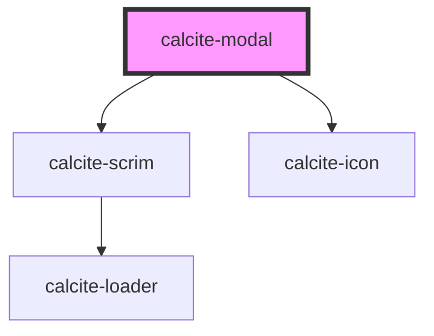

# calcite-modal

calcite modal allows you to show a modal/dialog to your users. The modal handles fencing focus and animating in/out. Customize the modal by passing your content into multiple named slots: `header` (title-area of the modal), `content` (main body of the modal), and up to three modal actions: primary, secondary, and back.

```html
<calcite-modal aria-labelledby="modal-title">
  <h3 slot="header" id="modal-title">Title of the modal</h3>
  <div slot="content">The actual content of the modal</div>
  <calcite-button slot="back" color="neutral" appearance="outline" icon="chevron-left" width="full">
    Back
  </calcite-button>
  <calcite-button slot="secondary" width="full" appearance="outline"> Cancel </calcite-button>
  <calcite-button slot="primary" width="full"> Save </calcite-button>
</calcite-modal>
```

Notice above we've used the `aria-labelledby` attribute, relating it to the title of the modal. In order to ensure good accessibility, it's recommended that you use either an `aria-label` or `aria-labelledby` attribute so screen readers can infer what the subject matter of your modal is.

To open a modal, add the `active` prop:

```html
<calcite-modal active></calcite-modal>
```

Once the opening animation is complete, the `calciteModalOpen` event will be fired.

To close the modal, simply remove the attribute. This will run your before close method (if provided, see below) and fire the `calciteModalClose` event after the animation and teardown is complete.

### beforeClose

If you'd like to perform some actions prior to closing (ie. warning users they will lose their changes) you can pass a function to the `beforeClose` property. This method will be called prior to close and should return a Promise:

```js
function beforeClose() {
  return new Promise((resolve) => {
    // do something async
    resolve(); // this will trigger the close animation
  });
}
modal.beforeClose = beforeClose;
```

<!-- Auto Generated Below -->

## Properties

| Property             | Attribute              | Description                                                                                                 | Type                                 | Default                   |
| -------------------- | ---------------------- | ----------------------------------------------------------------------------------------------------------- | ------------------------------------ | ------------------------- |
| `active`             | `active`               | Add the active attribute to open the modal                                                                  | `boolean`                            | `undefined`               |
| `backgroundColor`    | `background-color`     | Background color of modal content                                                                           | `"grey" \| "white"`                  | `"white"`                 |
| `beforeClose`        | --                     | Optionally pass a function to run before close                                                              | `(el: HTMLElement) => Promise<void>` | `() => Promise.resolve()` |
| `color`              | `color`                | Adds a color bar at the top for visual impact, Use color to add importance to destructive/workflow dialogs. | `"blue" \| "red"`                    | `undefined`               |
| `disableCloseButton` | `disable-close-button` | Disables the display a close button within the Modal                                                        | `boolean`                            | `undefined`               |
| `disableEscape`      | `disable-escape`       | Flag to disable the default close on escape behavior                                                        | `boolean`                            | `undefined`               |
| `docked`             | `docked`               | Prevent the modal from taking up the entire screen on mobile                                                | `boolean`                            | `undefined`               |
| `firstFocus`         | --                     | Specify an element to focus when the modal is first opened                                                  | `HTMLElement`                        | `undefined`               |
| `fullscreen`         | `fullscreen`           | Set the modal to always be fullscreen (overrides width)                                                     | `boolean`                            | `undefined`               |
| `intlClose`          | `intl-close`           | Aria label for the close button                                                                             | `string`                             | `"Close"`                 |
| `noPadding`          | `no-padding`           | Turn off spacing around the content area slot                                                               | `boolean`                            | `undefined`               |
| `scale`              | `scale`                | specify the scale of modal, defaults to m                                                                   | `"l" \| "m" \| "s"`                  | `"m"`                     |
| `theme`              | `theme`                | Select theme (light or dark)                                                                                | `"dark" \| "light"`                  | `undefined`               |
| `width`              | `width`                | Set the width of the modal. Can use stock sizes or pass a number (in pixels)                                | `"l" \| "m" \| "s" \| number`        | `"m"`                     |

## Events

| Event               | Description                                     | Type               |
| ------------------- | ----------------------------------------------- | ------------------ |
| `calciteModalClose` | Fired when the modal begins the close animation | `CustomEvent<any>` |
| `calciteModalOpen`  | Fired when the modal begins the open animation  | `CustomEvent<any>` |

## Methods

### `focusElement(el?: HTMLElement) => Promise<void>`

<span style="color:red">**[DEPRECATED]**</span> use `setFocus` instead.<br/><br/>Focus first interactive element

#### Returns

Type: `Promise<void>`

### `scrollContent(top?: number, left?: number) => Promise<void>`

Set the scroll top of the modal content

#### Returns

Type: `Promise<void>`

### `setFocus(focusId?: "close-button") => Promise<void>`

Sets focus on the component.

By default, will try to focus on any focusable content. If there is none, it will focus on the close button.
If you want to focus on the close button, you can use the `close-button` focus ID.

#### Returns

Type: `Promise<void>`

## Dependencies

### Depends on

- [calcite-scrim](../calcite-scrim)
- [calcite-icon](../calcite-icon)

### Graph



---

_Built with [StencilJS](https://stenciljs.com/)_
