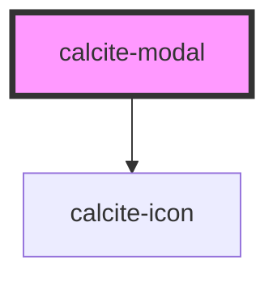

# calcite-modal

calcite modal allows you to show a modal/dialog to your users. The modal handles fencing focus and animating in/out. Customize the modal by passing your content into multiple named slots: `header` (title-area of the modal), `content` (main body of the modal), and up to three modal actions: primary, secondary, and back.

```html
<calcite-modal aria-labelledby="modal-title">
  <h3 slot="header" id="modal-title">Title of the modal</h3>
  <div slot="content">
    The actual content of the modal
  </div>
  <calcite-button slot="back" color="light" appearance="outline" icon="M15.707 20h-1.414l-7.5-7.5 7.5-7.5h1.414l-7.5 7.5z" width="full">
    Back
  </calcite-button>
  <calcite-button slot="secondary" width="full" appearance="outline">
    Cancel
  </calcite-button>
  <calcite-button slot="primary" width="full">
    Save
  </calcite-button>
</calcite-modal>
```

Notice above we've used the `aria-labelledby` attribute, relating it to the title of the modal. In order to ensure good accessibility, it's recommended that you use either an `aria-label` or `aria-labelledby` attribute so screen readers can infer what the subject matter of your modal is.

To open a modal, use the `open` method directly on the element:

```js
const modal = document.querySelector("calcite-modal");
modal.open();
```

The `open` method returns a promise which will resolve when the animation has completed:

```js
modal.open().then(el => console.log(el)); // => <calcite-modal> element
```

If you'd like to perform some actions prior to closing (ie. warning users they will lose their changes) you can pass a function to the `beforeClose` property. This method will be called prior to close and should return a Promise:

```js
function beforeClose () {
  return new Promise((resolve) => {
    // do something async
    resolve(); // this will trigger the close animation
  });
}
modal.beforeClose = beforeClose;
modal.open();
```

<!-- Auto Generated Below -->


## Properties

| Property        | Attribute        | Description                                                                                                  | Type                                             | Default                       |
| --------------- | ---------------- | ------------------------------------------------------------------------------------------------------------ | ------------------------------------------------ | ----------------------------- |
| `beforeClose`   | --               | Optionally pass a function to run before close                                                               | `(el: HTMLElement) => Promise<void>`             | `() =>     Promise.resolve()` |
| `closeLabel`    | `close-label`    | Aria label for the close button                                                                              | `string`                                         | `"Close"`                     |
| `color`         | `color`          | Adds a color bar at the top for visual impact, Use color to add importance to desctructive/workflow dialogs. | `"blue" \| "red"`                                | `undefined`                   |
| `disableEscape` | `disable-escape` | Flag to disable the default close on escape behavior                                                         | `boolean`                                        | `undefined`                   |
| `docked`        | `docked`         | Prevent the modal from taking up the entire screen on mobile                                                 | `boolean`                                        | `undefined`                   |
| `firstFocus`    | --               | Specify an element to focus when the modal is first opened                                                   | `HTMLElement`                                    | `undefined`                   |
| `noPadding`     | `no-padding`     | Turn off spacing around the content area slot                                                                | `boolean`                                        | `undefined`                   |
| `size`          | `size`           | Set the overall size of the modal                                                                            | `"fullscreen" \| "large" \| "medium" \| "small"` | `"small"`                     |
| `theme`         | `theme`          | Select theme (light or dark)                                                                                 | `"dark" \| "light"`                              | `"light"`                     |


## Events

| Event               | Description                                     | Type               |
| ------------------- | ----------------------------------------------- | ------------------ |
| `calciteModalClose` | Fired when the modal begins the close animation | `CustomEvent<any>` |
| `calciteModalOpen`  | Fired when the modal begins the open animation  | `CustomEvent<any>` |


## Methods

### `close() => Promise<HTMLElement>`

Close the modal, first running the `beforeClose` method

#### Returns

Type: `Promise<HTMLElement>`


### `focusElement(el?: HTMLElement) => Promise<void>`

Focus first interactive element

#### Returns

Type: `Promise<void>`


### `open() => Promise<HTMLElement>`

Open the modal

#### Returns

Type: `Promise<HTMLElement>`


### `scrollContent(top?: number, left?: number) => Promise<void>`

Set the scroll top of the modal content

#### Returns

Type: `Promise<void>`


## Dependencies

### Depends on

- [calcite-icon](../calcite-icon)

### Graph


----------------------------------------------

*Built with [StencilJS](https://stenciljs.com/)*
