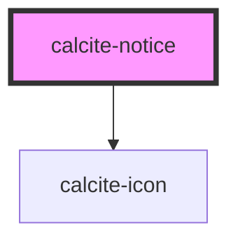

# calcite-notice

<!-- Auto Generated Below -->

## Usage

### Basic

You can programmatically focus the close button of a `dismissible` `calcite-notice` with the `setFocus()` method:

```html
<div onclick=document.querySelector('#my-notice').setFocus()>Focus!</div>
```

## Properties

| Property      | Attribute     | Description                                                                                                                                            | Type                                     | Default      |
| ------------- | ------------- | ------------------------------------------------------------------------------------------------------------------------------------------------------ | ---------------------------------------- | ------------ |
| `active`      | `active`      | Is the notice currently active or not                                                                                                                  | `boolean`                                | `false`      |
| `color`       | `color`       | Color for the notice (will apply to top border and icon)                                                                                               | `"blue" \| "green" \| "red" \| "yellow"` | `"blue"`     |
| `dismissible` | `dismissible` | Optionally show a button the user can click to dismiss the notice                                                                                      | `boolean`                                | `false`      |
| `icon`        | `icon`        | when used as a boolean set to true, show a default recommended icon. You can also pass a calcite-ui-icon name to this prop to display a requested icon | `boolean \| string`                      | `undefined`  |
| `intlClose`   | `intl-close`  | String for the close button.                                                                                                                           | `string`                                 | `TEXT.close` |
| `scale`       | `scale`       | specify the scale of the notice, defaults to m                                                                                                         | `"l" \| "m" \| "s"`                      | `"m"`        |
| `theme`       | `theme`       | Select theme (light or dark)                                                                                                                           | `"dark" \| "light"`                      | `undefined`  |
| `width`       | `width`       | specify the width of the notice, defaults to auto                                                                                                      | `"auto" \| "full" \| "half"`             | `"auto"`     |

## Events

| Event                | Description                    | Type               |
| -------------------- | ------------------------------ | ------------------ |
| `calciteNoticeClose` | Fired when an notice is closed | `CustomEvent<any>` |
| `calciteNoticeOpen`  | Fired when an Notice is opened | `CustomEvent<any>` |

## Methods

### `setFocus() => Promise<void>`

focus the close button, if present and requested

#### Returns

Type: `Promise<void>`

## Slots

| Slot        | Description                                                                   |
| ----------- | ----------------------------------------------------------------------------- |
| `"link"`    | Optional action to take from the notice (undo, try again, link to page, etc.) |
| `"message"` | Main text of the notice                                                       |
| `"title"`   | Title of the notice (optional)                                                |

## Dependencies

### Depends on

- [calcite-icon](../calcite-icon)

### Graph



---

_Built with [StencilJS](https://stenciljs.com/)_
