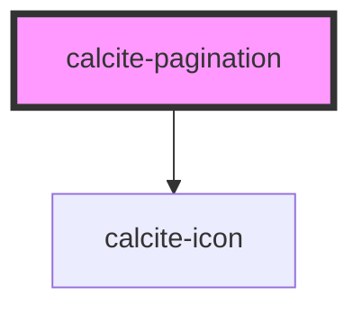

# calcite-pagination

<!-- Auto Generated Below -->

## Properties

| Property            | Attribute             | Description                                                                    | Type                                     | Default              |
| ------------------- | --------------------- | ------------------------------------------------------------------------------ | ---------------------------------------- | -------------------- |
| `backgroundStyle`   | `background-style`    | Change between foreground colors or background colors for container background | `"backgroundColor" \| "foregroundColor"` | `"foregroundColor"`  |
| `num`               | `num`                 | starting selected index                                                        | `number`                                 | `1`                  |
| `start`             | `start`               | starting number of the pagination                                              | `number`                                 | `1`                  |
| `textLabelNext`     | `text-label-next`     | title of the next button                                                       | `string`                                 | `TEXT.nextLabel`     |
| `textLabelPrevious` | `text-label-previous` | title of the previous button                                                   | `string`                                 | `TEXT.previousLabel` |
| `theme`             | `theme`               | specify the theme of accordion, defaults to light                              | `"dark" \| "light"`                      | `undefined`          |
| `total`             | `total`               | ending number of the pagination                                                | `number`                                 | `2`                  |

## Events

| Event                     | Description                                 | Type               |
| ------------------------- | ------------------------------------------- | ------------------ |
| `calcitePaginationUpdate` | Emitted whenever the selected page changes. | `CustomEvent<any>` |

## Methods

### `nextPage() => Promise<void>`

When called, selected page will increment by 1.

#### Returns

Type: `Promise<void>`

### `previousPage() => Promise<void>`

When called, selected page will decrement by 1.

#### Returns

Type: `Promise<void>`

### `setPage(num: number) => Promise<void>`

Set selected page to a specific page number. Will not go below start or above total.

#### Returns

Type: `Promise<void>`

## Dependencies

### Depends on

- [calcite-icon](../calcite-icon)

### Graph

----------------------------------------------

*Built with [StencilJS](https://stenciljs.com/)*
