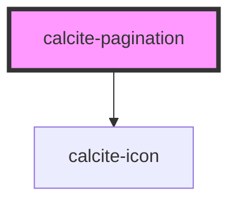

# calcite-pagination

Calcite pagination allows users to select a page from a paginated API. The component is meant to interface with responses from ArcGIS REST services, so the props share names with [response properties](https://developers.arcgis.com/rest/users-groups-and-items/search.htm) from various search endpoints.

For example, after querying the search API, you'll get back a response similar to the following:

```JSON
{
  "total": 2021,
  "start": 1,
  "num": 100,
  "results": []
}
```

These can be passed straight to the `calcite-pagination` component:

```html
<calcite-pagination start="1" num="100" total="2021"></calcite-pagination>
```

<!-- Auto Generated Below -->

## Properties

| Property            | Attribute             | Description                                       | Type                | Default              |
| ------------------- | --------------------- | ------------------------------------------------- | ------------------- | -------------------- |
| `num`               | `num`                 | number of items per page                          | `number`            | `20`                 |
| `scale`             | `scale`               | The scale of the pagination                       | `"l" \| "m" \| "s"` | `"m"`                |
| `start`             | `start`               | index of item that should begin the page          | `number`            | `1`                  |
| `textLabelNext`     | `text-label-next`     | title of the next button                          | `string`            | `TEXT.nextLabel`     |
| `textLabelPrevious` | `text-label-previous` | title of the previous button                      | `string`            | `TEXT.previousLabel` |
| `theme`             | `theme`               | specify the theme of accordion, defaults to light | `"dark" \| "light"` | `undefined`          |
| `total`             | `total`               | total number of items                             | `number`            | `0`                  |

## Events

| Event                     | Description                                                                                                                              | Type                                   |
| ------------------------- | ---------------------------------------------------------------------------------------------------------------------------------------- | -------------------------------------- |
| `calcitePaginationChange` | Emitted whenever the selected page changes.                                                                                              | `CustomEvent<CalcitePaginationDetail>` |
| `calcitePaginationUpdate` | <span style="color:red">**[DEPRECATED]**</span> use calcitePaginationChange instead<br/><br/>Emitted whenever the selected page changes. | `CustomEvent<CalcitePaginationDetail>` |

## Methods

### `nextPage() => Promise<void>`

Go to the next page of results

#### Returns

Type: `Promise<void>`

### `previousPage() => Promise<void>`

Go to the previous page of results

#### Returns

Type: `Promise<void>`

## Dependencies

### Depends on

- [calcite-icon](../calcite-icon)

### Graph



---

_Built with [StencilJS](https://stenciljs.com/)_
