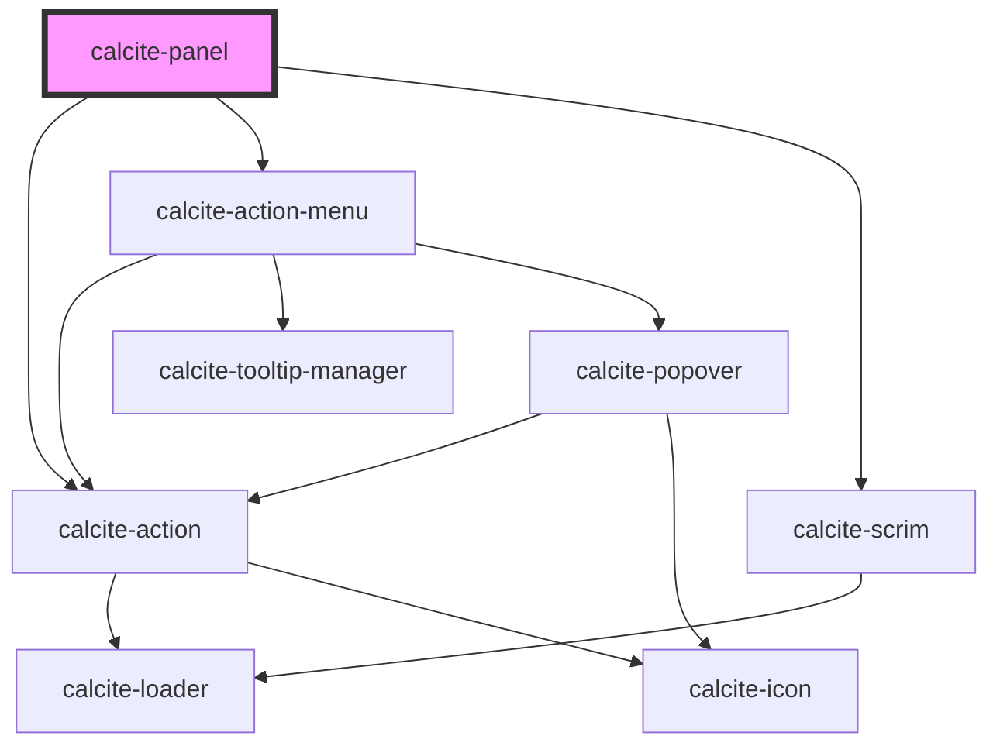

# calcite-panel

The `calcite-panel` component is a container for a header, content and optional footer. The header will have centered content as well as optional leading and trailing content. The panel can also be setup to be dismissible which allows it to be closed by a user.

<!-- Auto Generated Below -->

## Usage

### Basic

#### Basic

Renders a basic panel with a header.

```html
<calcite-panel>
  <div slot="header-content">Header!</div>
  <p>Slotted content!</p>
</calcite-panel>
```

#### With footer

Renders a panel with a header and a footer.

```html
<calcite-panel>
  <div slot="header-content">Header!</div>
  <p>I have a footer.</p>
  <div slot="footer">Footer!</div>
</calcite-panel>
```

#### Header with actions

Renders a panel with leading and trailing `calcite-action`s.

```html
<calcite-panel>
  <div slot="header-leading-content">
    <calcite-action label="Performs my custom action" text="Perform Action!" text-enabled icon="home"></calcite-action>
  </div>
  <div slot="header-content">Header!</div>
  <div slot="header-trailing-content">
    <calcite-action
      label="Performs another custom action"
      text="Perform Another Action!"
      text-enabled
      icon="blog"
    ></calcite-action>
  </div>
  <p>Actions are in the top left and right.</p>
</calcite-panel>
```

#### Dismissible panel

Renders a panel that is dismissible with a click of the "x".

```html
<calcite-panel dismissible id="dismissible-panel">
  <div slot="header-content">Dismissible Header</div>
  <p>Click the X and I go away!</p>
</calcite-panel>
```

## Properties

| Property         | Attribute          | Description                                                                                               | Type                         | Default     |
| ---------------- | ------------------ | --------------------------------------------------------------------------------------------------------- | ---------------------------- | ----------- |
| `beforeBack`     | --                 | When provided, this method will be called before it is removed from the parent flow.                      | `() => Promise<void>`        | `undefined` |
| `disabled`       | `disabled`         | When true, disabled prevents interaction. This state shows items with lower opacity/grayed.               | `boolean`                    | `false`     |
| `dismissed`      | `dismissed`        | Hides the panel.                                                                                          | `boolean`                    | `false`     |
| `dismissible`    | `dismissible`      | Displays a close button in the trailing side of the header.                                               | `boolean`                    | `false`     |
| `heading`        | `heading`          | Heading text.                                                                                             | `string`                     | `undefined` |
| `headingLevel`   | `heading-level`    | Number at which section headings should start for this component.                                         | `1 \| 2 \| 3 \| 4 \| 5 \| 6` | `undefined` |
| `heightScale`    | `height-scale`     | Specifies the maxiumum height of the panel.                                                               | `"l" \| "m" \| "s"`          | `undefined` |
| `intlBack`       | `intl-back`        | 'Back' text string.                                                                                       | `string`                     | `undefined` |
| `intlClose`      | `intl-close`       | 'Close' text string for the close button. The close button will only be shown when 'dismissible' is true. | `string`                     | `undefined` |
| `intlOptions`    | `intl-options`     | 'Options' text string for the actions menu.                                                               | `string`                     | `undefined` |
| `loading`        | `loading`          | When true, content is waiting to be loaded. This state shows a busy indicator.                            | `boolean`                    | `false`     |
| `menuOpen`       | `menu-open`        | Opens the action menu.                                                                                    | `boolean`                    | `false`     |
| `showBackButton` | `show-back-button` | Shows a back button in the header.                                                                        | `boolean`                    | `false`     |
| `summary`        | `summary`          | Summary text. A description displayed underneath the heading.                                             | `string`                     | `undefined` |
| `widthScale`     | `width-scale`      | This sets width of the panel.                                                                             | `"l" \| "m" \| "s"`          | `undefined` |

## Events

| Event                         | Description                                     | Type               |
| ----------------------------- | ----------------------------------------------- | ------------------ |
| `calcitePanelBackClick`       | Emitted when the back button has been clicked.  | `CustomEvent<any>` |
| `calcitePanelDismissedChange` | Emitted when the close button has been clicked. | `CustomEvent<any>` |
| `calcitePanelScroll`          | Emitted when the content has been scrolled.     | `CustomEvent<any>` |

## Methods

### `setFocus(focusId?: "dismiss-button" | "back-button") => Promise<void>`

#### Returns

Type: `Promise<void>`

## Slots

| Slot                     | Description                                                                      |
| ------------------------ | -------------------------------------------------------------------------------- |
| `"fab"`                  | a slot for adding a `calcite-fab` (floating action button) to perform an action. |
| `"footer"`               | a slot for adding custom content to the footer.                                  |
| `"footer-actions"`       | a slot for adding buttons to the footer.                                         |
| `"header-actions-end"`   | a slot for adding actions or content to the end side of the panel header.        |
| `"header-actions-start"` | a slot for adding actions or content to the start side of the panel header.      |
| `"header-content"`       | a slot for adding custom content to the header.                                  |
| `"header-menu-actions"`  | a slot for adding an overflow menu with actions inside a dropdown.               |

## Dependencies

### Depends on

- [calcite-action](../calcite-action)
- [calcite-action-menu](../calcite-action-menu)
- [calcite-scrim](../calcite-scrim)

### Graph



---

_Built with [StencilJS](https://stenciljs.com/)_
