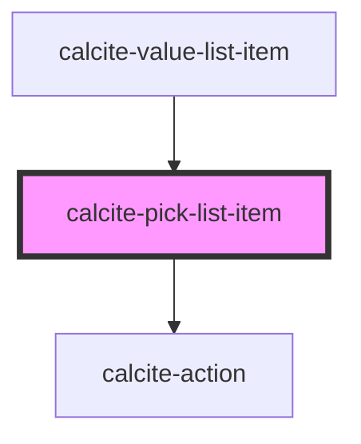

# calcite-pick-list-item

`calcite-pick-list-item`s are cards contained in a `calcite-pick-list`. They each can have a label and description, an icon, and be set to compact. The developer can disable or preselect each list item and give it a value.

<!-- Auto Generated Below -->

## Properties

| Property             | Attribute          | Description                                                                                       | Type                                                        | Default       |
| -------------------- | ------------------ | ------------------------------------------------------------------------------------------------- | ----------------------------------------------------------- | ------------- |
| `disableDeselect`    | `disable-deselect` | When false, the item cannot be deselected by user interaction.                                    | `boolean`                                                   | `false`       |
| `disabled`           | `disabled`         | When true, the item cannot be clicked and is visually muted.                                      | `boolean`                                                   | `false`       |
| `icon`               | `icon`             | Determines the icon SVG symbol that will be shown. Options are circle, square, grid or null.      | `ICON_TYPES.circle \| ICON_TYPES.grip \| ICON_TYPES.square` | `null`        |
| `metadata`           | --                 | Used to provide additional metadata to an item, primarily used when the parent list has a filter. | `object`                                                    | `undefined`   |
| `removable`          | `removable`        | Set this to true to display a remove action that removes the item from the list.                  | `boolean`                                                   | `false`       |
| `selected`           | `selected`         | Set this to true to pre-select an item. Toggles when an item is checked/unchecked.                | `boolean`                                                   | `false`       |
| `textDescription`    | `text-description` | An optional description for this item. This will appear below the label text.                     | `string`                                                    | `undefined`   |
| `textLabel`          | `text-label`       | The main label for this item. This will appear next to the icon.                                  | `string`                                                    | `undefined`   |
| `textRemove`         | `text-remove`      | The text for the remove item buttons. Only applicable if removable is true.                       | `string`                                                    | `TEXT.remove` |
| `value` _(required)_ | `value`            | A unique value used to identify this item - similar to the value attribute on an <input>.         | `string`                                                    | `undefined`   |

## Events

| Event                   | Description                                          | Type                                                                                                              |
| ----------------------- | ---------------------------------------------------- | ----------------------------------------------------------------------------------------------------------------- |
| `calciteListItemChange` | Emitted whenever the item is selected or unselected. | `CustomEvent<{ item: HTMLCalcitePickListItemElement; value: string; selected: boolean; shiftPressed: boolean; }>` |
| `calciteListItemRemove` | Emitted whenever the remove button is pressed.       | `CustomEvent<void>`                                                                                               |

## Methods

### `setFocus() => Promise<void>`

#### Returns

Type: `Promise<void>`

### `toggleSelected(coerce?: boolean) => Promise<void>`

Used to toggle the selection state. By default this won't trigger an event.
The first argument allows the value to be coerced, rather than swapping values.

#### Returns

Type: `Promise<void>`

## Slots

| Slot                 | Description                                                                                                                             |
| -------------------- | --------------------------------------------------------------------------------------------------------------------------------------- |
| `"secondary-action"` | A slot intended for adding a `calcite-action` or `calcite-button` to the right side of the card. This is placed at the end of the item. |

## Dependencies

### Used by

- [calcite-value-list-item](../calcite-value-list-item)

### Depends on

- [calcite-action](../calcite-action)

### Graph

---

_Built with [StencilJS](https://stenciljs.com/)_
