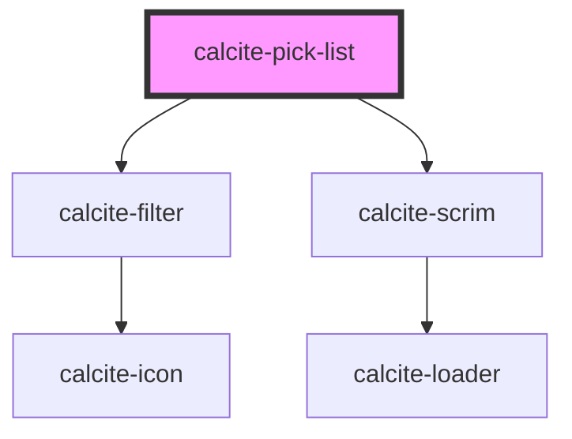

# calcite-pick-list

`calcite-pick-list` lives in a panel and contains `calcite-pick-list-item`s. Each item is able to be be selected via radio button or checkboxes (which have a multiselect and shift-click capability). There is also an option for a filter at the top of the list for searching.

<!-- Auto Generated Below -->

## Usage

### Basic

Renders a basic pick list with radio buttons on the left and actions on the right side.

```html
<calcite-pick-list>
  <calcite-pick-list-item text-label="T. Rex" text-description="Arm strength impaired" value="trex">
    <calcite-action slot="secondary-action" icon="circle"></calcite-action>
  </calcite-pick-list-item>
  <calcite-pick-list-item text-label="Triceratops" text-description="3 horn" value="triceratops" selected>
    <calcite-action slot="secondary-action" icon="circle"></calcite-action>
  </calcite-pick-list-item>
  <calcite-pick-list-item text-label="Velociraptor" text-description="Swift seizer" value="velociraptor">
    <calcite-action slot="secondary-action" icon="circle"></calcite-action>
  </calcite-pick-list-item>
</calcite-pick-list>
```

#### Multi-select & filter-enabled

Renders a pick list with a sticky filter and checkboxes for multiple selection of items.

```html
<calcite-pick-list multiple filter-enabled>
  <calcite-pick-list-item text-label="Chocolate" value="chocolate">
    <calcite-action slot="secondary-action" icon="ellipsis-circle"></calcite-action>
  </calcite-pick-list-item>
  <calcite-pick-list-item text-label="Vanilla" text-description="Oldie but goodie" value="vanilla">
    <calcite-action slot="secondary-action" icon="ellipsis-circle"></calcite-action>
  </calcite-pick-list-item>
  <calcite-pick-list-item text-label="Strawberry" text-description="no metadata on this one" value="strawberry">
    <calcite-action slot="secondary-action" icon="ellipsis-circle"></calcite-action>
  </calcite-pick-list-item>
</calcite-pick-list>
```

#### Sub groups

Renders groups of pick list items that are visually separated.

```html
<calcite-pick-list>
  <calcite-pick-list-group text-group-title="numbers">
    <calcite-pick-list-item text-heading="one" text-description="fish" value="one" icon="grip">
      <calcite-action slot="secondary-action" icon="ellipsis"></calcite-action>
    </calcite-pick-list-item>
    <calcite-pick-list-item text-heading="two" text-description="fish" value="two" icon="grip">
      <calcite-action slot="secondary-action" icon="ellipsis"></calcite-action>
    </calcite-pick-list-item>
  </calcite-pick-list-group>
  <calcite-pick-list-group text-group-title="colors">
    <calcite-pick-list-item text-heading="red" text-description="fish" value="red" icon="grip">
      <calcite-action slot="secondary-action" icon="ellipsis"></calcite-action>
    </calcite-pick-list-item>
    <calcite-pick-list-item text-heading="blue" text-description="fish" value="blue" icon="grip">
      <calcite-action slot="secondary-action" icon="ellipsis"></calcite-action>
    </calcite-pick-list-item>
  </calcite-pick-list-group>
</calcite-pick-list>
```

## Properties

| Property                | Attribute                 | Description                                                                                                                                                                                                                                       | Type      | Default                  |
| ----------------------- | ------------------------- | ------------------------------------------------------------------------------------------------------------------------------------------------------------------------------------------------------------------------------------------------- | --------- | ------------------------ |
| `disabled`              | `disabled`                | When true, disabled prevents interaction. This state shows items with lower opacity/grayed.                                                                                                                                                       | `boolean` | `false`                  |
| `filterEnabled`         | `filter-enabled`          | When true, an input appears at the top of the list that can be used by end users to filter items in the list.                                                                                                                                     | `boolean` | `false`                  |
| `loading`               | `loading`                 | When true, content is waiting to be loaded. This state shows a busy indicator.                                                                                                                                                                    | `boolean` | `false`                  |
| `multiple`              | `multiple`                | Multiple works similar to standard radio buttons and checkboxes. When true, a user can select multiple items at a time. When false, only a single item can be selected at a time and selecting a new item will deselect any other selected items. | `boolean` | `false`                  |
| `textFilterPlaceholder` | `text-filter-placeholder` | Placeholder text for the filter input field.                                                                                                                                                                                                      | `string`  | `TEXT.filterPlaceholder` |

## Events

| Event               | Description                                           | Type               |
| ------------------- | ----------------------------------------------------- | ------------------ |
| `calciteListChange` | Emitted when any of the item selections have changed. | `CustomEvent<any>` |

## Methods

### `getSelectedItems() => Promise<Map<string, HTMLCalcitePickListItemElement>>`

#### Returns

Type: `Promise<Map<string, HTMLCalcitePickListItemElement>>`

### `setFocus() => Promise<void>`

#### Returns

Type: `Promise<void>`

## Slots

| Slot             | Description                                                                                                                        |
| ---------------- | ---------------------------------------------------------------------------------------------------------------------------------- |
|                  | A slot for adding `calcite-pick-list-item` elements or `calcite-pick-list-group` elements. Items are displayed as a vertical list. |
| `"menu-actions"` | A slot for adding a button + menu combo for performing actions like sorting.                                                       |

## Dependencies

### Depends on

- [calcite-filter](../calcite-filter)
- [calcite-scrim](../calcite-scrim)

### Graph



---

_Built with [StencilJS](https://stenciljs.com/)_
