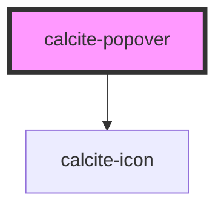

# calcite-popover

<!-- Auto Generated Below -->


## Usage

### AddClickHandle

```html
<calcite-popover reference-element="popover-button" add-click-handle
  >Hello! I am some popover content!</calcite-popover
>

<calcite-button
  id="popover-button"
  icon="M15.707 20h-1.414l-7.5-7.5 7.5-7.5h1.414l-7.5 7.5z"
  >Clickable popover</calcite-button
>
```


## Properties

| Property                        | Attribute           | Description                                                                                | Type                                                                                                                                                                                                                                                                                                              | Default                 |
| ------------------------------- | ------------------- | ------------------------------------------------------------------------------------------ | ----------------------------------------------------------------------------------------------------------------------------------------------------------------------------------------------------------------------------------------------------------------------------------------------------------------- | ----------------------- |
| `addClickHandle`                | `add-click-handle`  | Adds a click handler to the referenceElement to toggle open the Popover.                   | `boolean`                                                                                                                                                                                                                                                                                                         | `false`                 |
| `closeButton`                   | `close-button`      | Display a close button within the Popover.                                                 | `boolean`                                                                                                                                                                                                                                                                                                         | `false`                 |
| `disableFlip`                   | `disable-flip`      | Prevents flipping the popover's placement when it starts to overlap its reference element. | `boolean`                                                                                                                                                                                                                                                                                                         | `false`                 |
| `disablePointer`                | `disable-pointer`   | Removes the caret pointer.                                                                 | `boolean`                                                                                                                                                                                                                                                                                                         | `false`                 |
| `flipPlacements`                | --                  | Defines the available placements that can be used when a flip occurs.                      | `Placement[]`                                                                                                                                                                                                                                                                                                     | `undefined`             |
| `offsetDistance`                | `offset-distance`   | Offset the position of the popover away from the reference element.                        | `number`                                                                                                                                                                                                                                                                                                          | `defaultOffsetDistance` |
| `offsetSkidding`                | `offset-skidding`   | Offset the position of the popover along the reference element.                            | `number`                                                                                                                                                                                                                                                                                                          | `0`                     |
| `open`                          | `open`              | Display and position the component.                                                        | `boolean`                                                                                                                                                                                                                                                                                                         | `false`                 |
| `placement`                     | `placement`         | Determines where the component will be positioned relative to the referenceElement.        | `"auto" \| "auto-start" \| "auto-end" \| "top" \| "bottom" \| "right" \| "left" \| "top-start" \| "top-end" \| "bottom-start" \| "bottom-end" \| "right-start" \| "right-end" \| "left-start" \| "left-end" \| "leading-start" \| "leading" \| "leading-end" \| "trailing-end" \| "trailing" \| "trailing-start"` | `"auto"`                |
| `referenceElement` _(required)_ | `reference-element` | Reference HTMLElement used to position this component according to the placement property. | `HTMLElement \| string`                                                                                                                                                                                                                                                                                           | `undefined`             |
| `textClose`                     | `text-close`        | Text for close button.                                                                     | `string`                                                                                                                                                                                                                                                                                                          | `"Close"`               |
| `theme`                         | `theme`             | Select theme (light or dark)                                                               | `"dark" \| "light"`                                                                                                                                                                                                                                                                                               | `"light"`               |


## Events

| Event                 | Description                      | Type               |
| --------------------- | -------------------------------- | ------------------ |
| `calcitePopoverClose` | Fired when the popover is closed | `CustomEvent<any>` |
| `calcitePopoverOpen`  | Fired when the popover is opened | `CustomEvent<any>` |


## Methods

### `reposition() => Promise<void>`


#### Returns

Type: `Promise<void>`


### `setFocus(focusId?: "close-button") => Promise<void>`


#### Returns

Type: `Promise<void>`


### `toggle() => Promise<void>`


#### Returns

Type: `Promise<void>`


## Slots

| Slot      | Description                                                                     |
| --------- | ------------------------------------------------------------------------------- |
| `"image"` | A slot for adding an image. The image will appear above the other slot content. |


## Dependencies

### Depends on

- [calcite-icon](../calcite-icon)

### Graph


----------------------------------------------

*Built with [StencilJS](https://stenciljs.com/)*
