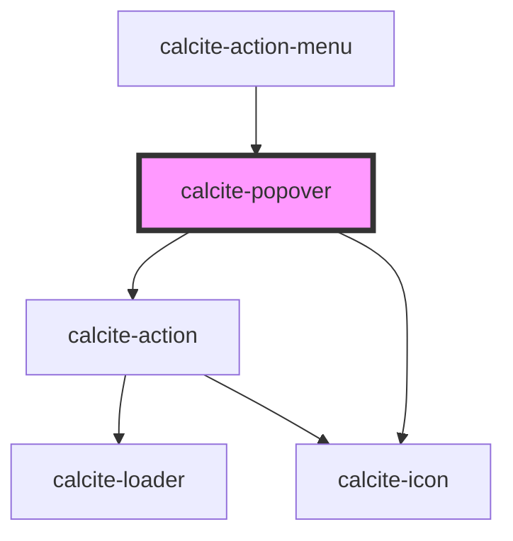

# calcite-popover

<!-- Auto Generated Below -->

## Usage

### Manager

```html
<calcite-popover reference-element="popover-button">Hello! I am some popover content!</calcite-popover>

<calcite-popover-manager
  ><calcite-button id="popover-button">Clickable popover</calcite-button></calcite-popover-manager
>
```

## Properties

| Property                        | Attribute             | Description                                                                                                                        | Type                                        | Default                 |
| ------------------------------- | --------------------- | ---------------------------------------------------------------------------------------------------------------------------------- | ------------------------------------------- | ----------------------- |
| `closeButton`                   | `close-button`        | Display a close button within the Popover.                                                                                         | `boolean`                                   | `false`                 |
| `disableFlip`                   | `disable-flip`        | Prevents flipping the popover's placement when it starts to overlap its reference element.                                         | `boolean`                                   | `false`                 |
| `disablePointer`                | `disable-pointer`     | Removes the caret pointer.                                                                                                         | `boolean`                                   | `false`                 |
| `flipPlacements`                | --                    | Defines the available placements that can be used when a flip occurs.                                                              | `Placement[]`                               | `undefined`             |
| `heading`                       | `heading`             | Heading text.                                                                                                                      | `string`                                    | `undefined`             |
| `headingLevel`                  | `heading-level`       | Number at which section headings should start for this component.                                                                  | `1 \| 2 \| 3 \| 4 \| 5 \| 6`                | `undefined`             |
| `intlClose`                     | `intl-close`          | Text for close button.                                                                                                             | `string`                                    | `TEXT.close`            |
| `label` _(required)_            | `label`               | Accessible name for the component                                                                                                  | `string`                                    | `undefined`             |
| `offsetDistance`                | `offset-distance`     | Offset the position of the popover away from the reference element.                                                                | `number`                                    | `defaultOffsetDistance` |
| `offsetSkidding`                | `offset-skidding`     | Offset the position of the popover along the reference element.                                                                    | `number`                                    | `0`                     |
| `open`                          | `open`                | Display and position the component.                                                                                                | `boolean`                                   | `false`                 |
| `overlayPositioning`            | `overlay-positioning` | Describes the type of positioning to use for the overlaid content. If your element is in a fixed container, use the 'fixed' value. | `"absolute" \| "fixed"`                     | `"absolute"`            |
| `placement`                     | `placement`           | Determines where the component will be positioned relative to the referenceElement.                                                | `Placement \| PlacementRtl \| VariationRtl` | `"auto"`                |
| `referenceElement` _(required)_ | `reference-element`   | Reference HTMLElement used to position this component according to the placement property.                                         | `HTMLElement \| string`                     | `undefined`             |

## Events

| Event                 | Description                      | Type               |
| --------------------- | -------------------------------- | ------------------ |
| `calcitePopoverClose` | Fired when the popover is closed | `CustomEvent<any>` |
| `calcitePopoverOpen`  | Fired when the popover is opened | `CustomEvent<any>` |

## Methods

### `reposition() => Promise<void>`

#### Returns

Type: `Promise<void>`

### `setFocus(focusId?: PopoverFocusId) => Promise<void>`

#### Returns

Type: `Promise<void>`

### `toggle(value?: boolean) => Promise<void>`

#### Returns

Type: `Promise<void>`

## Slots

| Slot      | Description                                                                     |
| --------- | ------------------------------------------------------------------------------- |
| `"image"` | A slot for adding an image. The image will appear above the other slot content. |

## Dependencies

### Used by

- [calcite-action-menu](../calcite-action-menu)

### Depends on

- [calcite-action](../calcite-action)
- [calcite-icon](../calcite-icon)

### Graph



---

_Built with [StencilJS](https://stenciljs.com/)_
