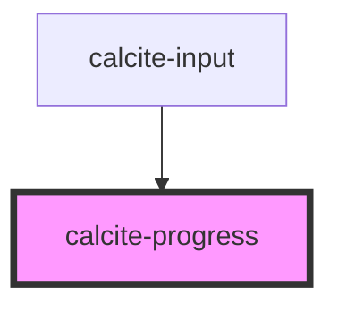

# calcite-progress

The `calcite-progress` component is used to show progress on some async task to the user.

```html
<calcite-progress type="indeterminate"></calcite-progress>
```

## TODO

<!-- Auto Generated Below -->


## Properties

| Property   | Attribute  | Description                                                      | Type                               | Default         |
| ---------- | ---------- | ---------------------------------------------------------------- | ---------------------------------- | --------------- |
| `reversed` | `reversed` | For indeterminate progress bars, reverse the animation direction | `boolean`                          | `false`         |
| `text`     | `text`     | Text label for the progress indicator                            | `string`                           | `null`          |
| `theme`    | `theme`    | Select theme (light or dark)                                     | `"dark" \| "light"`                | `undefined`     |
| `type`     | `type`     | Use indeterminate if finding actual progress value is impossible | `"determinate" \| "indeterminate"` | `"determinate"` |
| `value`    | `value`    | Fraction completed, in the range of 0 - 1.0                      | `number`                           | `0`             |


## Dependencies

### Used by

 - [calcite-input](../calcite-input)

### Graph


----------------------------------------------

*Built with [StencilJS](https://stenciljs.com/)*
