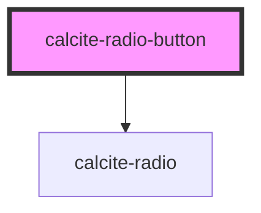

# calcite-radio-button

<!-- Auto Generated Below -->

## Properties

| Property             | Attribute  | Description                                                                                                                                  | Type                | Default     |
| -------------------- | ---------- | -------------------------------------------------------------------------------------------------------------------------------------------- | ------------------- | ----------- |
| `checked`            | `checked`  | The checked state of the radio button.                                                                                                       | `boolean`           | `false`     |
| `disabled`           | `disabled` | The disabled state of the radio button.                                                                                                      | `boolean`           | `false`     |
| `focused`            | `focused`  | The focused state of the radio button.                                                                                                       | `boolean`           | `false`     |
| `guid`               | `guid`     | The id attribute of the radio button. When omitted, a globally unique identifier is used.                                                    | `string`            | `undefined` |
| `hidden`             | `hidden`   | The radio button's hidden status. When a radio button is hidden it is not focusable or checkable.                                            | `boolean`           | `false`     |
| `hovered`            | `hovered`  | The hovered state of the radio button.                                                                                                       | `boolean`           | `false`     |
| `name`               | `name`     | The name of the radio button. <code>name</code> is passed as a property automatically from <code>calcite-radio-button-group</code>.          | `string`            | `undefined` |
| `required`           | `required` | Requires that a value is selected for the radio button group before the parent form will submit.                                             | `boolean`           | `false`     |
| `scale`              | `scale`    | The scale (size) of the radio button. <code>scale</code> is passed as a property automatically from <code>calcite-radio-button-group</code>. | `"l" \| "m" \| "s"` | `"m"`       |
| `value` _(required)_ | `value`    | The value of the radio button.                                                                                                               | `any`               | `undefined` |

## Events

| Event                      | Description                                                                                                                                                                                                                                                                                                                                                                                                                                             | Type               |
| -------------------------- | ------------------------------------------------------------------------------------------------------------------------------------------------------------------------------------------------------------------------------------------------------------------------------------------------------------------------------------------------------------------------------------------------------------------------------------------------------- | ------------------ |
| `calciteRadioButtonChange` | Fires only when the radio button is checked. This behavior is identical to the native HTML input element. Since this event does not fire when the radio button is unchecked, it's not recommended to attach a listener for this event directly on the element, but instead either attach it to a node that contains all of the radio buttons in the group or use the calciteRadioButtonGroupChange event if using this with calcite-radio-button-group. | `CustomEvent<any>` |

## Methods

### `setFocus() => Promise<void>`

#### Returns

Type: `Promise<void>`

## Dependencies

### Depends on

- [calcite-radio](../calcite-radio)

### Graph

---

_Built with [StencilJS](https://stenciljs.com/)_
