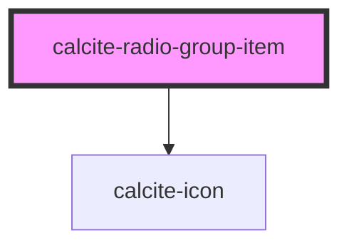

# calcite-radio-group-item

<!-- Auto Generated Below -->

## Properties

| Property       | Attribute       | Description                                                        | Type               | Default     |
| -------------- | --------------- | ------------------------------------------------------------------ | ------------------ | ----------- |
| `checked`      | `checked`       | Indicates whether the control is checked.                          | `boolean`          | `false`     |
| `icon`         | `icon`          | optionally pass an icon to display - accepts Calcite UI icon names | `string`           | `undefined` |
| `iconPosition` | `icon-position` | optionally used with icon, select where to position the icon       | `"end" \| "start"` | `"start"`   |
| `value`        | `value`         | The control's value.                                               | `any`              | `undefined` |

## Events

| Event                         | Description | Type               |
| ----------------------------- | ----------- | ------------------ |
| `calciteRadioGroupItemChange` |             | `CustomEvent<any>` |

## Dependencies

### Depends on

- [calcite-icon](../calcite-icon)

### Graph

---

_Built with [StencilJS](https://stenciljs.com/)_
