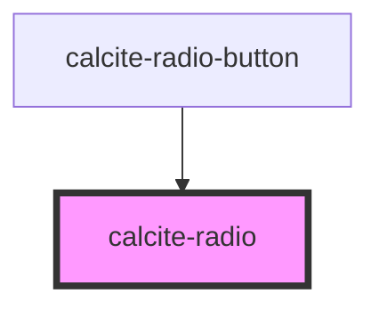

# calcite-radio

Renders small, medium and large radio circles. This is an internal component used by `calcite-radio-button`.

<!-- Auto Generated Below -->

## Properties

| Property   | Attribute  | Description                      | Type                | Default |
| ---------- | ---------- | -------------------------------- | ------------------- | ------- |
| `checked`  | `checked`  | The checked state of the radio.  | `boolean`           | `false` |
| `disabled` | `disabled` | The disabled state of the radio. | `boolean`           | `false` |
| `focused`  | `focused`  | The focused state of the radio.  | `boolean`           | `false` |
| `hidden`   | `hidden`   | The radio's hidden status.       | `boolean`           | `false` |
| `hovered`  | `hovered`  | The hovered state of the radio.  | `boolean`           | `false` |
| `scale`    | `scale`    | The scale (size) of the radio.   | `"l" \| "m" \| "s"` | `"m"`   |

## Dependencies

### Used by

- [calcite-radio-button](../calcite-radio-button)

### Graph

---

_Built with [StencilJS](https://stenciljs.com/)_
