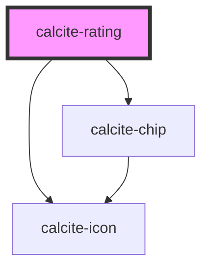

# calcite-rating

<!-- Auto Generated Below -->

## Properties

| Property       | Attribute       | Description                                                | Type                 | Default     |
| -------------- | --------------- | ---------------------------------------------------------- | -------------------- | ----------- |
| `average`      | `average`       | optionally pass a cumulative average rating to display     | `number`             | `undefined` |
| `count`        | `count`         | optionally pass a number of previous ratings to display    | `number`             | `undefined` |
| `disabled`     | `disabled`      | is the rating component in a selectable mode               | `boolean`            | `false`     |
| `displayValue` | `display-value` | display rating value                                       | `boolean`            | `false`     |
| `iconType`     | `icon-type`     | specify the icon used for the rating, defaults to star     | `"circle" \| "star"` | `"star"`    |
| `length`       | `length`        | specify the length of rating scale, defaults to 5          | `number`             | `5`         |
| `precision`    | `precision`     | the precision of the rating component - half or whole step | `"half" \| "whole"`  | `"whole"`   |
| `readOnly`     | `read-only`     | is the rating component in a selectable mode               | `boolean`            | `false`     |
| `scale`        | `scale`         | specify the scale of the component, defaults to m          | `"l" \| "m" \| "s"`  | `"m"`       |
| `theme`        | `theme`         | specify the theme of scrim, defaults to light              | `"dark" \| "light"`  | `undefined` |
| `value`        | `value`         | the value of the rating component                          | `number`             | `0`         |

## Events

| Event                 | Description | Type               |
| --------------------- | ----------- | ------------------ |
| `calciteRatingChange` |             | `CustomEvent<any>` |

## Dependencies

### Depends on

- [calcite-icon](../calcite-icon)
- [calcite-chip](../calcite-chip)

### Graph

---

_Built with [StencilJS](https://stenciljs.com/)_
