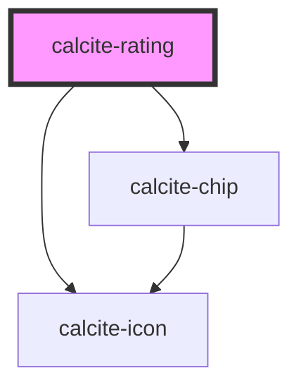

# calcite-rating

## Labeling for a11y

```
<calcite-rating intl-rating="Label for rating"></calcite-rating>
```

<!-- Auto Generated Below -->

## Properties

| Property     | Attribute     | Description                                                                                     | Type                | Default       |
| ------------ | ------------- | ----------------------------------------------------------------------------------------------- | ------------------- | ------------- |
| `average`    | `average`     | optionally pass a cumulative average rating to display                                          | `number`            | `undefined`   |
| `count`      | `count`       | optionally pass a number of previous ratings to display                                         | `number`            | `undefined`   |
| `disabled`   | `disabled`    | is the rating component in a selectable mode                                                    | `boolean`           | `false`       |
| `intlRating` | `intl-rating` | Localized string for "Rating" (used for aria label)                                             | `string`            | `TEXT.rating` |
| `intlStars`  | `intl-stars`  | Localized string for labelling each star, `${num}` in the string will be replaced by the number | `string`            | `TEXT.stars`  |
| `readOnly`   | `read-only`   | is the rating component in a selectable mode                                                    | `boolean`           | `false`       |
| `scale`      | `scale`       | specify the scale of the component, defaults to m                                               | `"l" \| "m" \| "s"` | `"m"`         |
| `showChip`   | `show-chip`   | Show average and count data summary chip (if available)                                         | `boolean`           | `false`       |
| `value`      | `value`       | the value of the rating component                                                               | `number`            | `0`           |

## Events

| Event                 | Description                              | Type                              |
| --------------------- | ---------------------------------------- | --------------------------------- |
| `calciteRatingChange` | Fires when the rating value has changed. | `CustomEvent<{ value: number; }>` |

## Methods

### `setFocus() => Promise<void>`

#### Returns

Type: `Promise<void>`

## Dependencies

### Depends on

- [calcite-icon](../calcite-icon)
- [calcite-chip](../calcite-chip)

### Graph



---

_Built with [StencilJS](https://stenciljs.com/)_
