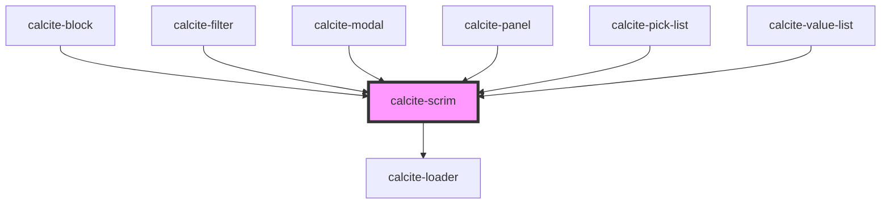

# calcite-scrim

<!-- Auto Generated Below -->

## Usage

### Basic

### Simple panel example

```html
<div style="position: relative; width: 200px; height: 200px; overflow: auto;">
  <calcite-scrim>
    <p>I'm a panel that is not loading.</p>
    <p>This content can have any zIndex and it will not be placed above</p>
    <p>.</p>
    <p>.</p>
    <p>.</p>
    <p>.</p>
  </calcite-scrim>
</div>
```

### Loading scrim panel

```html
<div style="position: relative; width: 200px; height: 200px; overflow: auto;">
  <calcite-scrim loading>
    <p>I'm a panel that is not loading.</p>
    <p>I have a loading spinner over my content.</p>
    <p>.</p>
    <p>.</p>
    <p>.</p>
    <p>.</p>
  </calcite-scrim>
</div>
```

## Properties

| Property      | Attribute      | Description                                                                                             | Type                | Default        |
| ------------- | -------------- | ------------------------------------------------------------------------------------------------------- | ------------------- | -------------- |
| `intlLoading` | `intl-loading` | string to override English loading text                                                                 | `string`            | `TEXT.loading` |
| `loading`     | `loading`      | Determines if the component will have the loader overlay. Otherwise, will render opaque disabled state. | `boolean`           | `false`        |
| `theme`       | `theme`        | specify the theme of scrim, defaults to light                                                           | `"dark" \| "light"` | `undefined`    |

## Dependencies

### Used by

- [calcite-block](../calcite-block)
- [calcite-filter](../calcite-filter)
- [calcite-modal](../calcite-modal)
- [calcite-panel](../calcite-panel)
- [calcite-pick-list](../calcite-pick-list)
- [calcite-value-list](../calcite-value-list)

### Depends on

- [calcite-loader](../calcite-loader)

### Graph



---

_Built with [StencilJS](https://stenciljs.com/)_
