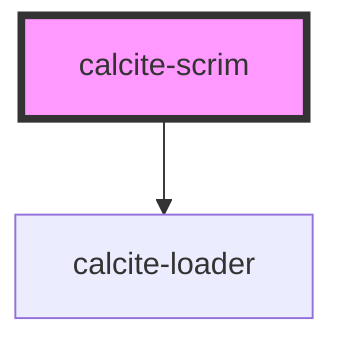

# calcite-scrim

<!-- Auto Generated Below -->

## Properties

| Property  | Attribute | Description                                                                                             | Type      | Default |
| --------- | --------- | ------------------------------------------------------------------------------------------------------- | --------- | ------- |
| `loading` | `loading` | Determines if the component will have the loader overlay. Otherwise, will render opaque disabled state. | `boolean` | `false` |

## Dependencies

### Depends on

- [calcite-loader](../calcite-loader)

### Graph

---

_Built with [StencilJS](https://stenciljs.com/)_
