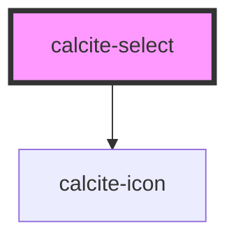

# calcite-select

This component represents a menu of options.

<!-- Auto Generated Below -->

## Usage

### Basic

#### Default

```html
<calcite-select>
  <calcite-option>high</calcite-option>
  <calcite-option>medium</calcite-option>
  <calcite-option>low</calcite-option>
</calcite-select>
```

#### Specifying underlying value

```html
<calcite-select>
  <calcite-option value="high">😃</calcite-option>
  <calcite-option value="medium">😶</calcite-option>
  <calcite-option value="low">😭</calcite-option>
</calcite-select>
```

#### Specifying different value than option content

```html
<calcite-select>
  <calcite-option label="high">1</calcite-option>
  <calcite-option label="medium">2</calcite-option>
  <calcite-option label="low">3</calcite-option>
</calcite-select>
```

#### Grouped

```html
<calcite-select>
  <calcite-option-group label="letters">
    <calcite-option>a</calcite-option>
    <calcite-option>b</calcite-option>
    <calcite-option>c</calcite-option>
  </calcite-option-group>
  <calcite-option-group label="numbers">
    <calcite-option>1</calcite-option>
    <calcite-option selected>2</calcite-option>
    <calcite-option>3</calcite-option>
  </calcite-option-group>
</calcite-select>
```

### Side by side (container is flex-box)

```html
<div class="demo-side-by-side">
  <calcite-select width="half" label="half width">
    <calcite-option>☕️</calcite-option>
    <calcite-option>🍵</calcite-option>
    <calcite-option selected>🍻</calcite-option>
  </calcite-select>
  <calcite-select width="half" label="half width">
    <calcite-option selected>🌮</calcite-option>
    <calcite-option>🍔</calcite-option>
    <calcite-option>🌯</calcite-option>
  </calcite-select>
</div>
```

### Disabling items and/or groups

```html
<calcite-select>
  <calcite-option-group label="letters">
    <calcite-option>a</calcite-option>
    <calcite-option>b</calcite-option>
    <calcite-option>c</calcite-option>
    <calcite-option disabled>d (disabled)</calcite-option>
  </calcite-option-group>
  <calcite-option-group label="numbers">
    <calcite-option disabled>1 (disabled)</calcite-option>
    <calcite-option>2</calcite-option>
    <calcite-option selected>2</calcite-option>
  </calcite-option-group>
  <calcite-option-group label="non-selectable" disabled>
    <calcite-option>You-Know-Who</calcite-option>
    <calcite-option selected>Tom Marvolo Riddle</calcite-option>
    <calcite-option>He-Who-Must-Not-Be-Named</calcite-option>
    <calcite-option>Voldemort</calcite-option>
  </calcite-option-group>
</calcite-select>
```

## Properties

| Property             | Attribute         | Description                                                         | Type                         | Default     |
| -------------------- | ----------------- | ------------------------------------------------------------------- | ---------------------------- | ----------- |
| `disabled`           | `disabled`        | When true, it prevents the option from being selected.              | `boolean`                    | `false`     |
| `label` _(required)_ | `label`           | The component's label. This is required for accessibility purposes. | `string`                     | `undefined` |
| `scale`              | `scale`           | The component scale.                                                | `"l" \| "m" \| "s"`          | `"m"`       |
| `selectedOption`     | `selected-option` | The currently selected option.                                      | `any`                        | `undefined` |
| `width`              | `width`           | The component width.                                                | `"auto" \| "full" \| "half"` | `"auto"`    |

## Events

| Event                 | Description                                                | Type                |
| --------------------- | ---------------------------------------------------------- | ------------------- |
| `calciteSelectChange` | This event will fire whenever the selected option changes. | `CustomEvent<void>` |

## Methods

### `setFocus() => Promise<void>`

#### Returns

Type: `Promise<void>`

## Dependencies

### Depends on

- [calcite-icon](../calcite-icon)

### Graph



---

_Built with [StencilJS](https://stenciljs.com/)_
