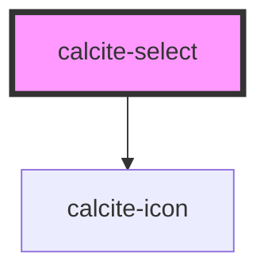

# calcite-select

This component represents a menu of options.

<!-- Auto Generated Below -->

## Properties

| Property             | Attribute  | Description                                                         | Type                         | Default     |
| -------------------- | ---------- | ------------------------------------------------------------------- | ---------------------------- | ----------- |
| `disabled`           | `disabled` | When true, it prevents the option from being selected.              | `boolean`                    | `false`     |
| `label` _(required)_ | `label`    | The component's label. This is required for accessibility purposes. | `string`                     | `undefined` |
| `scale`              | `scale`    | The component scale.                                                | `"l" \| "m" \| "s"`          | `"m"`       |
| `theme`              | `theme`    | The component theme.                                                | `"dark" \| "light"`          | `"light"`   |
| `width`              | `width`    | The component width.                                                | `"auto" \| "full" \| "half"` | `"auto"`    |

## Events

| Event                 | Description                                                | Type                |
| --------------------- | ---------------------------------------------------------- | ------------------- |
| `calciteSelectChange` | This event will fire whenever the selected option changes. | `CustomEvent<void>` |

## Methods

### `setFocus() => Promise<void>`

#### Returns

Type: `Promise<void>`

## Dependencies

### Depends on

- [calcite-icon](../calcite-icon)

### Graph

---

_Built with [StencilJS](https://stenciljs.com/)_
