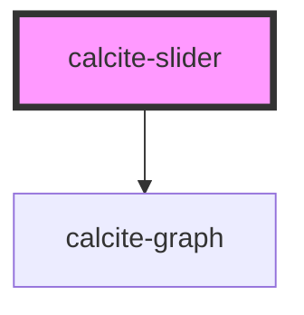

# calcite-slider

Range selection component for selecting single or multiple numeric values inside a given range.

<!-- Auto Generated Below -->

## Usage

### Basic

```html
<calcite-slider min="1" max="100" value="50" step="1"></calcite-slider>
```

### Two-handles

If you'd like to allow an upper and lower value selection (two handles), you can set `min-value` and `max-value` rather than `value`. Note: these are mutually exclusive.

```html
<calcite-slider
  min="1"
  max="100"
  min-value="50"
  max-value="85"
  step="1"
  min-label="Temperature (lower)"
  max-label="Temperature (upper)"
></calcite-slider>
```

## Properties

| Property         | Attribute       | Description                                                                                                                                 | Type          | Default     |
| ---------------- | --------------- | ------------------------------------------------------------------------------------------------------------------------------------------- | ------------- | ----------- |
| `disabled`       | `disabled`      | Disable and gray out the slider                                                                                                             | `boolean`     | `false`     |
| `hasHistogram`   | `has-histogram` | Indicates if a histogram is present                                                                                                         | `boolean`     | `false`     |
| `histogram`      | --              | Display a histogram above the slider                                                                                                        | `Point[]`     | `undefined` |
| `histogramStops` | --              | Array of values describing a single color stop, sorted by offset ascending.                                                                 | `ColorStop[]` | `undefined` |
| `labelHandles`   | `label-handles` | Label handles with their numeric value                                                                                                      | `boolean`     | `false`     |
| `labelTicks`     | `label-ticks`   | Label tick marks with their numeric value.                                                                                                  | `boolean`     | `false`     |
| `max`            | `max`           | Maximum selectable value                                                                                                                    | `number`      | `100`       |
| `maxLabel`       | `max-label`     | Used as an accessible label (aria-label) for second handle if needed (ex. "Temperature, upper bound")                                       | `string`      | `undefined` |
| `maxValue`       | `max-value`     | Currently selected upper number (if multi-select)                                                                                           | `number`      | `undefined` |
| `min`            | `min`           | Minimum selectable value                                                                                                                    | `number`      | `0`         |
| `minLabel`       | `min-label`     | Used as an accessible label (aria-label) for first (or only) handle (ex. "Temperature, lower bound")                                        | `string`      | `undefined` |
| `minValue`       | `min-value`     | Currently selected lower number (if multi-select)                                                                                           | `number`      | `undefined` |
| `mirrored`       | `mirrored`      | When true, the slider will display values from high to low. Note that this value will be ignored if the slider has an associated histogram. | `boolean`     | `false`     |
| `pageStep`       | `page-step`     | Interval to move on page up/page down keys                                                                                                  | `number`      | `undefined` |
| `precise`        | `precise`       | Use finer point for handles                                                                                                                 | `boolean`     | `false`     |
| `snap`           | `snap`          | When true, enables snap selection along the step interval                                                                                   | `boolean`     | `false`     |
| `step`           | `step`          | Interval to move on up/down keys                                                                                                            | `number`      | `1`         |
| `ticks`          | `ticks`         | Show tick marks on the number line at provided interval                                                                                     | `number`      | `undefined` |
| `value`          | `value`         | Currently selected number (if single select)                                                                                                | `number`      | `null`      |

## Events

| Event                 | Description                                                                                                                                                                                                                                                                                            | Type               |
| --------------------- | ------------------------------------------------------------------------------------------------------------------------------------------------------------------------------------------------------------------------------------------------------------------------------------------------------ | ------------------ |
| `calciteSliderChange` | Fires on all updates to the slider. :warning: Will be fired frequently during drag. If you are performing any expensive operations consider using a debounce or throttle to avoid locking up the main thread.                                                                                          | `CustomEvent<any>` |
| `calciteSliderUpdate` | <span style="color:red">**[DEPRECATED]**</span> use calciteSliderChange instead<br/><br/>Fires on all updates to the slider. :warning: Will be fired frequently during drag. If you are performing any expensive operations consider using a debounce or throttle to avoid locking up the main thread. | `CustomEvent<any>` |

## Methods

### `setFocus() => Promise<void>`

Sets focus on the component.

#### Returns

Type: `Promise<void>`

## Dependencies

### Depends on

- [calcite-graph](../calcite-graph)

### Graph



---

_Built with [StencilJS](https://stenciljs.com/)_
