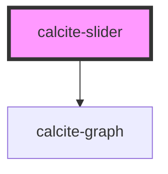

# calcite-slider

Range selection component for selecting single or multiple numeric values inside a given range.

<!-- Auto Generated Below -->

## Properties

| Property       | Attribute       | Description                                                        | Type                | Default     |
| -------------- | --------------- | ------------------------------------------------------------------ | ------------------- | ----------- |
| `disabled`     | `disabled`      | Disable and gray out the slider                                    | `boolean`           | `false`     |
| `hasHistogram` | `has-histogram` | Indicates if a histogram is present                                | `boolean`           | `false`     |
| `histogram`    | --              | Display a histogram above the slider                               | `Point[]`           | `undefined` |
| `labelHandles` | `label-handles` | Label handles with their numeric value                             | `boolean`           | `undefined` |
| `labelTicks`   | `label-ticks`   | Label tick marks with their numeric value.                         | `boolean`           | `undefined` |
| `max`          | `max`           | Maximum selectable value                                           | `number`            | `100`       |
| `maxLabel`     | `max-label`     | Label for second handle if needed (ex. "Temperature, upper bound") | `string`            | `undefined` |
| `maxValue`     | `max-value`     | Currently selected upper number (if multi-select)                  | `number`            | `undefined` |
| `min`          | `min`           | Minimum selectable value                                           | `number`            | `0`         |
| `minLabel`     | `min-label`     | Label for first (or only) handle (ex. "Temperature, lower bound")  | `string`            | `undefined` |
| `minValue`     | `min-value`     | Currently selected lower number (if multi-select)                  | `number`            | `undefined` |
| `pageStep`     | `page-step`     | Interval to move on page up/page down keys                         | `number`            | `undefined` |
| `precise`      | `precise`       | Use finer point for handles                                        | `boolean`           | `undefined` |
| `snap`         | `snap`          | When true, enables snap selection along the step interval          | `boolean`           | `false`     |
| `step`         | `step`          | Interval to move on up/down keys                                   | `number`            | `1`         |
| `theme`        | `theme`         | Select theme (light or dark)                                       | `"dark" \| "light"` | `undefined` |
| `ticks`        | `ticks`         | Show tick marks on the number line at provided interval            | `number`            | `undefined` |
| `value`        | `value`         | Currently selected number (if single select)                       | `number`            | `null`      |

## Events

| Event                 | Description                                                                                                                                                                                                                                                                                            | Type               |
| --------------------- | ------------------------------------------------------------------------------------------------------------------------------------------------------------------------------------------------------------------------------------------------------------------------------------------------------ | ------------------ |
| `calciteSliderChange` | Fires on all updates to the slider. :warning: Will be fired frequently during drag. If you are performing any expensive operations consider using a debounce or throttle to avoid locking up the main thread.                                                                                          | `CustomEvent<any>` |
| `calciteSliderUpdate` | **[DEPRECATED]** use calciteSliderChange instead  Fires on all updates to the slider. :warning: Will be fired frequently during drag. If you are performing any expensive operations consider using a debounce or throttle to avoid locking up the main thread. | `CustomEvent<any>` |

## Methods

### `setFocus() => Promise<void>`

#### Returns

Type: `Promise<void>`

## Dependencies

### Depends on

- [calcite-graph](../calcite-graph)

### Graph

---

_Built with [StencilJS](https://stenciljs.com/)_
