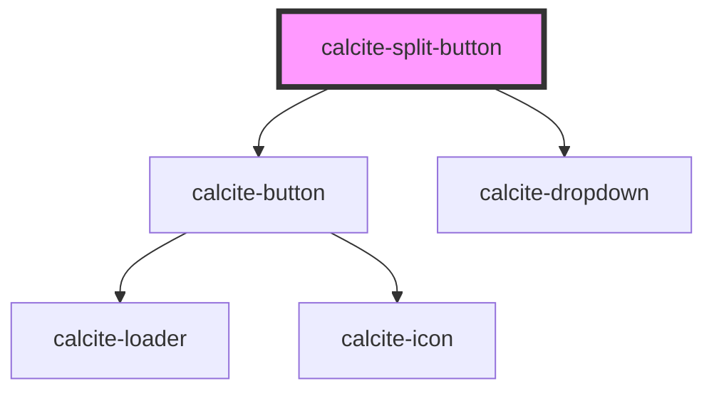

# calcite-split-button

The calcite-split-button control is one that combines a button with a dropdown menu in order to provide a primary action along with one or more related secondary options / actions. It's useful for grouping related actions or options for users, while elevating a commonly-used or default action for easier access. Its inner content populates the control's dropdown menu, and is thus expected to be valid `calcite-dropdown` content.

<!-- Auto Generated Below -->

## Usage

### Basic

```html
<calcite-split-button primary-icon-start="save" primary-text="Primary Option">
  <calcite-dropdown-group selection-mode="none">
    <calcite-dropdown-item>Option 2</calcite-dropdown-item>
    <calcite-dropdown-item>Option 3</calcite-dropdown-item>
    <calcite-dropdown-item>Option 4</calcite-dropdown-item>
  </calcite-dropdown-group>
</calcite-split-button>
```

## Properties

| Property             | Attribute               | Description                                                                                              | Type                                               | Default     |
| -------------------- | ----------------------- | -------------------------------------------------------------------------------------------------------- | -------------------------------------------------- | ----------- |
| `appearance`         | `appearance`            | specify the appearance style of the button, defaults to solid.                                           | `"clear" \| "outline" \| "solid" \| "transparent"` | `"solid"`   |
| `color`              | `color`                 | specify the color of the control, defaults to blue                                                       | `"blue" \| "inverse" \| "neutral" \| "red"`        | `"blue"`    |
| `disabled`           | `disabled`              | is the control disabled                                                                                  | `boolean`                                          | `undefined` |
| `dropdownIconType`   | `dropdown-icon-type`    | specify the icon used for the dropdown menu, defaults to chevron                                         | `"caret" \| "chevron" \| "ellipsis" \| "overflow"` | `"chevron"` |
| `dropdownLabel`      | `dropdown-label`        | aria label for overflow button                                                                           | `string`                                           | `undefined` |
| `loading`            | `loading`               | optionally add a calcite-loader component to the control, disabling interaction. with the primary button | `boolean`                                          | `false`     |
| `primaryIconEnd`     | `primary-icon-end`      | optionally pass an icon to display at the end of the primary button - accepts Calcite UI icon names      | `string`                                           | `undefined` |
| `primaryIconFlipRtl` | `primary-icon-flip-rtl` | flip the primary icon(s) in rtl                                                                          | `"both" \| "end" \| "start"`                       | `undefined` |
| `primaryIconStart`   | `primary-icon-start`    | optionally pass an icon to display at the start of the primary button - accepts Calcite UI icon names    | `string`                                           | `undefined` |
| `primaryLabel`       | `primary-label`         | optionally pass an aria-label for the primary button                                                     | `string`                                           | `undefined` |
| `primaryText`        | `primary-text`          | text for primary action button                                                                           | `string`                                           | `undefined` |
| `scale`              | `scale`                 | specify the scale of the control, defaults to m                                                          | `"l" \| "m" \| "s"`                                | `"m"`       |

## Events

| Event                              | Description                                | Type               |
| ---------------------------------- | ------------------------------------------ | ------------------ |
| `calciteSplitButtonPrimaryClick`   | fired when the primary button is clicked   | `CustomEvent<any>` |
| `calciteSplitButtonSecondaryClick` | fired when the secondary button is clicked | `CustomEvent<any>` |

## Dependencies

### Depends on

- [calcite-button](../calcite-button)
- [calcite-dropdown](../calcite-dropdown)

### Graph



---

_Built with [StencilJS](https://stenciljs.com/)_
