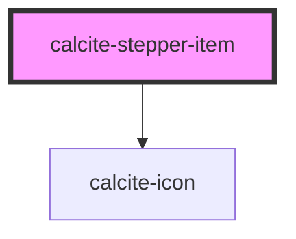

# calcite-stepper-item

individual `calcite-stepper-item` item

<!-- Auto Generated Below -->

## Properties

| Property       | Attribute       | Description                                                          | Type      | Default     |
| -------------- | --------------- | -------------------------------------------------------------------- | --------- | ----------- |
| `active`       | `active`        | is the step active                                                   | `boolean` | `false`     |
| `complete`     | `complete`      | has the step been completed                                          | `boolean` | `false`     |
| `disabled`     | `disabled`      | is the step disabled and not navigable to by a user                  | `boolean` | `false`     |
| `error`        | `error`         | does the step contain an error that needs to be resolved by the user | `boolean` | `false`     |
| `itemSubtitle` | `item-subtitle` | pass a title for the stepper item                                    | `string`  | `undefined` |
| `itemTitle`    | `item-title`    | pass a title for the stepper item                                    | `string`  | `undefined` |

## Events

| Event                        | Description | Type               |
| ---------------------------- | ----------- | ------------------ |
| `calciteStepperItemKeyEvent` |             | `CustomEvent<any>` |
| `calciteStepperItemRegister` |             | `CustomEvent<any>` |
| `calciteStepperItemSelect`   |             | `CustomEvent<any>` |

## Dependencies

### Depends on

- [calcite-icon](../calcite-icon)

### Graph

----------------------------------------------

*Built with [StencilJS](https://stenciljs.com/)*
