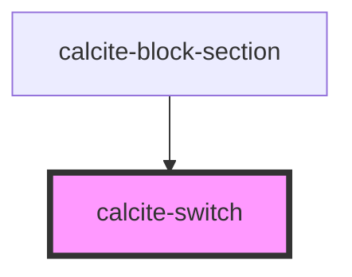

# calcite-switch

`calcite-switch` is used to toggle a value on or off.

<!-- Auto Generated Below -->

## Usage

### Basic

```html
<label> <calcite-switch switched></calcite-switch> Switch is on </label>
```

### Framework-integration

You can optionally pass in a checkbox. This is useful when using a framework like React to get around their synthetic event handling:

```jsx
<calcite-switch>
  <input name="myCheckbox" type="checkbox" onChange={this.handleInputChange} />
</calcite-switch>
```

## Properties

| Property   | Attribute  | Description                        | Type                | Default     |
| ---------- | ---------- | ---------------------------------- | ------------------- | ----------- |
| `disabled` | `disabled` | True if the switch is disabled     | `boolean`           | `false`     |
| `name`     | `name`     | The name of the checkbox input     | `string`            | `""`        |
| `scale`    | `scale`    | The scale of the switch            | `"l" \| "m" \| "s"` | `"m"`       |
| `switched` | `switched` | True if the switch is initially on | `boolean`           | `false`     |
| `theme`    | `theme`    | The component's theme.             | `"dark" \| "light"` | `undefined` |
| `value`    | `value`    | The value of the checkbox input    | `string`            | `""`        |

## Events

| Event                 | Description                                | Type               |
| --------------------- | ------------------------------------------ | ------------------ |
| `calciteSwitchChange` | Fires when the switched value has changed. | `CustomEvent<any>` |

## Dependencies

### Used by

- [calcite-block-section](../calcite-block-section)

### Graph



---

_Built with [StencilJS](https://stenciljs.com/)_
