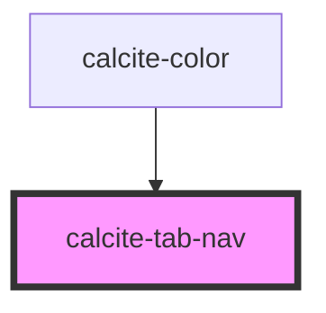

# calcite-tab-nav

The tab-nav groups several [calcite-tab-title](../calcite-tab-title) components and builds out the navigation. You can optionally use attibutes on the tab-nav to configure client side storage of the selected tab.

<!-- Auto Generated Below -->

## Properties

| Property    | Attribute    | Description                                                                       | Type     | Default     |
| ----------- | ------------ | --------------------------------------------------------------------------------- | -------- | ----------- |
| `storageId` | `storage-id` | Name to use when saving selected tab data to localStorage                         | `string` | `undefined` |
| `syncId`    | `sync-id`    | Pass the same string to multiple tab navs to keep them all in sync if one changes | `string` | `undefined` |

## Events

| Event              | Description                         | Type                                |
| ------------------ | ----------------------------------- | ----------------------------------- |
| `calciteTabChange` | Emitted when the active tab changes | `CustomEvent<TabChangeEventDetail>` |

## Dependencies

### Used by

 - [calcite-color](../calcite-color)

### Graph

----------------------------------------------

*Built with [StencilJS](https://stenciljs.com/)*
