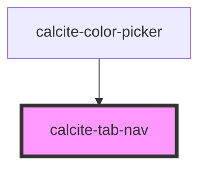

# calcite-tab-nav

The tab-nav groups several [calcite-tab-title](../calcite-tab-title) components and builds out the navigation. You can optionally use attibutes on the tab-nav to configure client side storage of the selected tab.

<!-- Auto Generated Below -->

## Usage

### Basic

When tab-nav is the only parent, tab-title can inherit its `scale` and `position` from tab-nav:

```html
<calcite-tab-nav scale="l" position="below">
  <calcite-tab-title>Layers</calcite-tab-title>
  <calcite-tab-title>Maps</calcite-tab-title>
  <calcite-tab-title active>Data</calcite-tab-title>
</calcite-tab-nav>
```

## Properties

| Property    | Attribute    | Description                                                                       | Type     | Default     |
| ----------- | ------------ | --------------------------------------------------------------------------------- | -------- | ----------- |
| `storageId` | `storage-id` | Name to use when saving selected tab data to localStorage                         | `string` | `undefined` |
| `syncId`    | `sync-id`    | Pass the same string to multiple tab navs to keep them all in sync if one changes | `string` | `undefined` |

## Events

| Event              | Description                         | Type                                |
| ------------------ | ----------------------------------- | ----------------------------------- |
| `calciteTabChange` | Emitted when the active tab changes | `CustomEvent<TabChangeEventDetail>` |

## Slots

| Slot | Description                             |
| ---- | --------------------------------------- |
|      | A slot for adding `calcite-tab-title`s. |

## Dependencies

### Used by

- [calcite-color-picker](../calcite-color-picker)

### Graph



---

_Built with [StencilJS](https://stenciljs.com/)_
