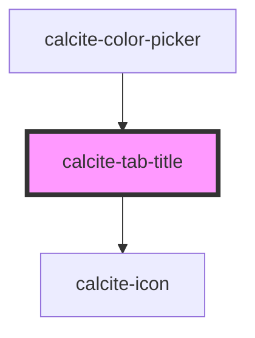

# calcite-tab-title

The tab-title is the link that switches between panes in [calcite-tabs](../calcite-tabs).

<!-- Auto Generated Below -->

## Properties

| Property      | Attribute       | Description                                                                                              | Type                         | Default     |
| ------------- | --------------- | -------------------------------------------------------------------------------------------------------- | ---------------------------- | ----------- |
| `active`      | `active`        | Show this tab title as selected                                                                          | `boolean`                    | `false`     |
| `disabled`    | `disabled`      | Disable this tab title                                                                                   | `boolean`                    | `false`     |
| `iconEnd`     | `icon-end`      | optionally pass an icon to display at the end of a tab title - accepts calcite ui icon names             | `string`                     | `undefined` |
| `iconFlipRtl` | `icon-flip-rtl` | flip the icon(s) in rtl                                                                                  | `"both" \| "end" \| "start"` | `undefined` |
| `iconStart`   | `icon-start`    | optionally pass an icon to display at the start of a tab title - accepts calcite ui icon names           | `string`                     | `undefined` |
| `tab`         | `tab`           | Optionally include a unique name for the tab title, be sure to also set this name on the associated tab. | `string`                     | `undefined` |

## Events

| Event                 | Description                                                                                                    | Type                                |
| --------------------- | -------------------------------------------------------------------------------------------------------------- | ----------------------------------- |
| `calciteTabsActivate` | Fires when a specific tab is activated. `event.details`: [TabChangeEventDetail](../../interfaces/TabChange.ts) | `CustomEvent<TabChangeEventDetail>` |

## Methods

### `getTabIndex() => Promise<number>`

Return the index of this title within the nav

#### Returns

Type: `Promise<number>`

## Dependencies

### Used by

- [calcite-color-picker](../calcite-color-picker)

### Depends on

- [calcite-icon](../calcite-icon)

### Graph

---

_Built with [StencilJS](https://stenciljs.com/)_
