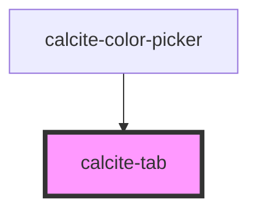

# calcite-tab

calcite-tab wraps the content you would like to appear when that tab is selected:

```html
<calcite-tab> My stuff! </calcite-tab>
```

<!-- Auto Generated Below -->

## Properties

| Property | Attribute | Description                                                                                           | Type      | Default     |
| -------- | --------- | ----------------------------------------------------------------------------------------------------- | --------- | ----------- |
| `active` | `active`  | Show this tab                                                                                         | `boolean` | `false`     |
| `tab`    | `tab`     | Optionally include a unique name for this tab, be sure to also set this name on the associated title. | `string`  | `undefined` |

## Methods

### `getTabIndex() => Promise<number>`

Return the index of this tab within the tab array

#### Returns

Type: `Promise<number>`

## Dependencies

### Used by

- [calcite-color-picker](../calcite-color-picker)

### Graph



---

_Built with [StencilJS](https://stenciljs.com/)_
