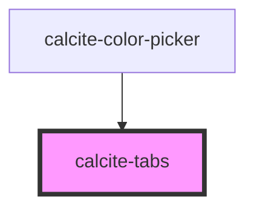

# calcite-tabs

<!-- Auto Generated Below -->

## Properties

| Property   | Attribute  | Description                                                                      | Type                   | Default     |
| ---------- | ---------- | -------------------------------------------------------------------------------- | ---------------------- | ----------- |
| `layout`   | `layout`   | Align tab titles to the edge or fully justify them across the tab nav ("center") | `"center" \| "inline"` | `"inline"`  |
| `position` | `position` | Display the tabs above (default) or below the tab content                        | `"above" \| "below"`   | `"above"`   |
| `theme`    | `theme`    | Select theme (light or dark)                                                     | `"dark" \| "light"`    | `undefined` |

## Dependencies

### Used by

- [calcite-color-picker](../calcite-color-picker)

### Graph

---

_Built with [StencilJS](https://stenciljs.com/)_
