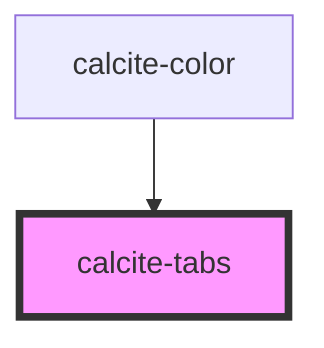

# calcite-tabs

calcite-tabs uses several sub-components ([calcite-tab-nav](../calcite-tab-nav), [calcite-tab](../calcite-tab), [calcite-tab-title](../calcite-tab-title)) to create a tabbed interface with optional client side storage. Place your content inside of the `<calcite-tab>` element:

```html
<calcite-tabs>
  <calcite-tab-nav slot="tab-nav">
    <calcite-tab-title active>Tab 1 Title</calcite-tab-title>
    <calcite-tab-title>Tab 2 Title</calcite-tab-title>
  </calcite-tab-nav>

  <calcite-tab active>Tab 1 Content</calcite-tab>
  <calcite-tab>Tab 2 Content</calcite-tab>
</calcite-tabs>
```

<!-- Auto Generated Below -->


## Properties

| Property   | Attribute  | Description                                                                      | Type                   | Default     |
| ---------- | ---------- | -------------------------------------------------------------------------------- | ---------------------- | ----------- |
| `layout`   | `layout`   | Align tab titles to the edge or fully justify them across the tab nav ("center") | `"center" \| "inline"` | `"inline"`  |
| `position` | `position` | Display the tabs above (default) or below the tab content                        | `"above" \| "below"`   | `"above"`   |
| `theme`    | `theme`    | Select theme (light or dark)                                                     | `"dark" \| "light"`    | `undefined` |


## Dependencies

### Used by

 - [calcite-color](../calcite-color)

### Graph


----------------------------------------------

*Built with [StencilJS](https://stenciljs.com/)*
