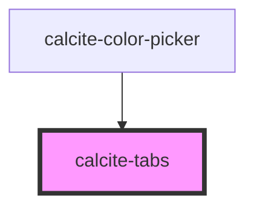

# calcite-tabs

<!-- Auto Generated Below -->

## Usage

### Basic

`calcite-tabs` uses several sub-components ([calcite-tab-nav](../calcite-tab-nav), [calcite-tab](../calcite-tab), [calcite-tab-title](../calcite-tab-title)) to create a tabbed interface with optional client side storage. Place your content inside of the `<calcite-tab>` element:

```html
<calcite-tabs>
  <calcite-tab-nav slot="tab-nav">
    <calcite-tab-title active>Tab 1 Title</calcite-tab-title>
    <calcite-tab-title>Tab 2 Title</calcite-tab-title>
  </calcite-tab-nav>

  <calcite-tab active>Tab 1 Content</calcite-tab>
  <calcite-tab>Tab 2 Content</calcite-tab>
</calcite-tabs>
```

### Bordered

```html
<calcite-tabs bordered>
  <calcite-tab-nav slot="tab-nav">
    <calcite-tab-title tab="tab1">Tab 1 Title</calcite-tab-title>
    <calcite-tab-title tab="tab2">Tab 2 Title</calcite-tab-title>
    <calcite-tab-title tab="tab3">Tab 3 Title</calcite-tab-title>
    <calcite-tab-title tab="tab4" active>Tab 4 Title</calcite-tab-title>
  </calcite-tab-nav>
  <calcite-tab tab="tab1">Tab 1 Content</calcite-tab>
  <calcite-tab tab="tab2">Tab 2 Content</calcite-tab>
  <calcite-tab tab="tab3">Tab 3 Content</calcite-tab>
  <calcite-tab tab="tab4" active>Tab 4 Content</calcite-tab>
</calcite-tabs>
```

## Properties

| Property   | Attribute  | Description                                                                           | Type                   | Default    |
| ---------- | ---------- | ------------------------------------------------------------------------------------- | ---------------------- | ---------- |
| `bordered` | `bordered` | Optionally enable tabs to appear like a folder-style menu when its layout is "inline" | `boolean`              | `false`    |
| `layout`   | `layout`   | Align tab titles to the edge or fully justify them across the tab nav ("center")      | `"center" \| "inline"` | `"inline"` |
| `position` | `position` | Display the tabs above (default) or below the tab content                             | `"above" \| "below"`   | `"above"`  |
| `scale`    | `scale`    | Specify the scale of the tabs component, defaults to m                                | `"l" \| "m" \| "s"`    | `"m"`      |

## Slots

| Slot        | Description                                   |
| ----------- | --------------------------------------------- |
|             | A slot for adding `calcite-tab`s.             |
| `"tab-nav"` | A slot for adding a tab navigation component. |

## Dependencies

### Used by

- [calcite-color-picker](../calcite-color-picker)

### Graph



---

_Built with [StencilJS](https://stenciljs.com/)_
