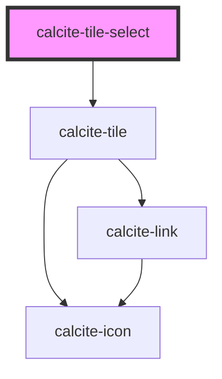

# calcite-tile-select

<!-- Auto Generated Below -->

## Properties

| Property      | Attribute     | Description | Type                          | Default     |
| ------------- | ------------- | ----------- | ----------------------------- | ----------- |
| `checked`     | `checked`     |             | `boolean`                     | `false`     |
| `description` | `description` |             | `string`                      | `undefined` |
| `disabled`    | `disabled`    |             | `boolean`                     | `false`     |
| `focused`     | `focused`     |             | `boolean`                     | `false`     |
| `heading`     | `heading`     |             | `string`                      | `undefined` |
| `hidden`      | `hidden`      |             | `boolean`                     | `false`     |
| `icon`        | `icon`        |             | `string`                      | `undefined` |
| `name`        | `name`        |             | `string`                      | `""`        |
| `showInput`   | `show-input`  |             | `"left" \| "none" \| "right"` | `"left"`    |
| `theme`       | `theme`       |             | `"dark" \| "light"`           | `"light"`   |
| `type`        | `type`        |             | `"checkbox" \| "radio"`       | `"radio"`   |
| `value`       | `value`       |             | `string`                      | `undefined` |

## Dependencies

### Depends on

- [calcite-tile](../calcite-tile)

### Graph

---

_Built with [StencilJS](https://stenciljs.com/)_
