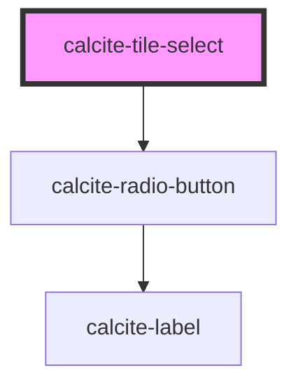

# calcite-tile-select

<!-- Auto Generated Below -->

## Properties

| Property | Attribute | Description | Type     | Default     |
| -------- | --------- | ----------- | -------- | ----------- |
| `name`   | `name`    |             | `string` | `undefined` |
| `value`  | `value`   |             | `string` | `undefined` |

## Dependencies

### Depends on

- [calcite-radio-button](../calcite-radio-button)

### Graph

---

_Built with [StencilJS](https://stenciljs.com/)_
