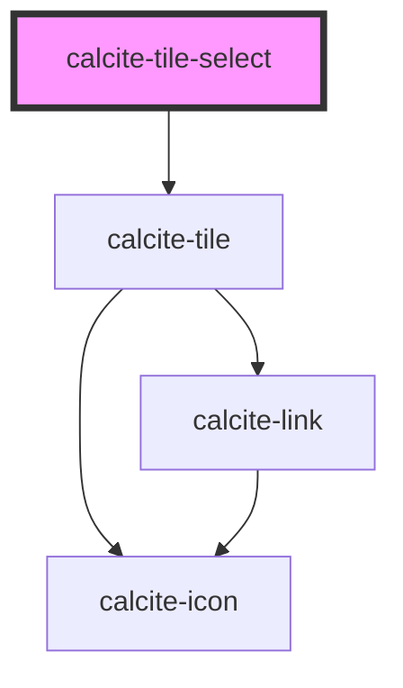

# calcite-tile-select

<!-- Auto Generated Below -->

## Usage

### Basic

```html
<calcite-tile-select
  checked
  input-enabled
  description="Leverage agile frameworks to provide a robust synopsis for high level overviews. Iterative approaches to corporate strategy foster collab on thinking to further the overall."
  heading="Tile heading lorem ipsum"
  icon="layer"
  input-alignment="end"
  type="radio"
  value="one"
></calcite-tile-select>
```

## Properties

| Property         | Attribute         | Description                                                                                                                                   | Type                    | Default     |
| ---------------- | ----------------- | --------------------------------------------------------------------------------------------------------------------------------------------- | ----------------------- | ----------- |
| `checked`        | `checked`         | The checked state of the tile select.                                                                                                         | `boolean`               | `false`     |
| `description`    | `description`     | The description text that appears beneath the heading of the tile.                                                                            | `string`                | `undefined` |
| `disabled`       | `disabled`        | The disabled state of the tile select.                                                                                                        | `boolean`               | `false`     |
| `heading`        | `heading`         | The heading text that appears between the icon and description of the tile.                                                                   | `string`                | `undefined` |
| `hidden`         | `hidden`          | The hidden state of the tile select.                                                                                                          | `boolean`               | `false`     |
| `icon`           | `icon`            | The icon that appears at the top of the tile.                                                                                                 | `string`                | `undefined` |
| `inputAlignment` | `input-alignment` | The side of the tile that the radio or checkbox appears on when inputEnabled is true.                                                         | `"end" \| "start"`      | `"start"`   |
| `inputEnabled`   | `input-enabled`   | Display an interactive radio or checkbox.                                                                                                     | `boolean`               | `false`     |
| `name`           | `name`            | The name of the tile select. This name will appear in form submissions as either a radio or checkbox identifier based on the `type` property. | `string`                | `""`        |
| `type`           | `type`            | The selection mode of the tile select: radio (single) or checkbox (multiple).                                                                 | `"checkbox" \| "radio"` | `"radio"`   |
| `value`          | `value`           | The value of the tile select. This value will appear in form submissions when this tile select is checked.                                    | `any`                   | `undefined` |
| `width`          | `width`           | specify the width of the tile, defaults to auto                                                                                               | `"auto" \| "full"`      | `"auto"`    |

## Methods

### `setFocus() => Promise<void>`

Sets focus on the component.

#### Returns

Type: `Promise<void>`

## Slots

| Slot | Description                       |
| ---- | --------------------------------- |
|      | A slot for adding custom content. |

## Dependencies

### Depends on

- [calcite-tile](../calcite-tile)

### Graph



---

_Built with [StencilJS](https://stenciljs.com/)_
