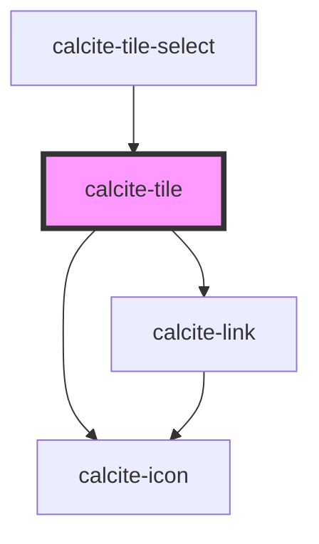

# calcite-tile

<!-- Auto Generated Below -->

## Properties

| Property      | Attribute     | Description                                                                                              | Type      | Default     |
| ------------- | ------------- | -------------------------------------------------------------------------------------------------------- | --------- | ----------- |
| `active`      | `active`      | The active state of the tile.                                                                            | `boolean` | `undefined` |
| `description` | `description` | The description text that appears beneath the heading of the tile.                                       | `string`  | `undefined` |
| `embed`       | `embed`       | The embed mode of the tile. When true, renders without a border and padding for use by other components. | `boolean` | `false`     |
| `focused`     | `focused`     | The focused state of the tile.                                                                           | `boolean` | `false`     |
| `heading`     | `heading`     | The heading text that appears between the icon and description of the tile.                              | `string`  | `undefined` |
| `hidden`      | `hidden`      | The hidden state of the tile.                                                                            | `boolean` | `false`     |
| `href`        | `href`        | The (optional) url for the tile. (Only applies when embed is set to false)                               | `string`  | `undefined` |
| `icon`        | `icon`        | The icon that appears at the top of the tile.                                                            | `string`  | `undefined` |

## Dependencies

### Used by

- [calcite-tile-select](../calcite-tile-select)

### Depends on

- [calcite-icon](../calcite-icon)
- [calcite-link](../calcite-link)

### Graph

---

_Built with [StencilJS](https://stenciljs.com/)_
