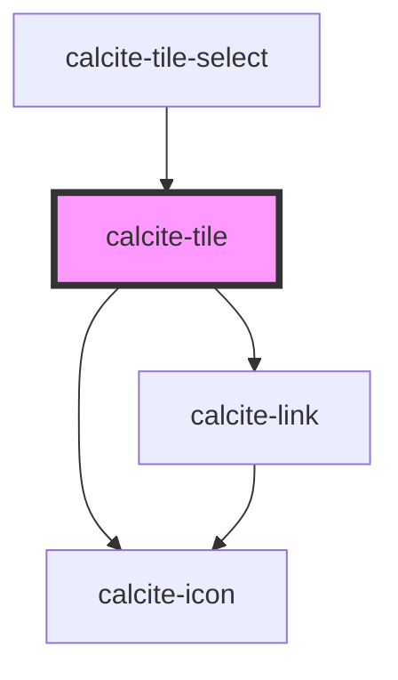

# calcite-tile

<!-- Auto Generated Below -->

## Properties

| Property      | Attribute     | Description | Type                | Default     |
| ------------- | ------------- | ----------- | ------------------- | ----------- |
| `active`      | `active`      |             | `boolean`           | `undefined` |
| `description` | `description` |             | `string`            | `undefined` |
| `embed`       | `embed`       |             | `boolean`           | `false`     |
| `focused`     | `focused`     |             | `boolean`           | `false`     |
| `heading`     | `heading`     |             | `string`            | `undefined` |
| `hidden`      | `hidden`      |             | `boolean`           | `false`     |
| `href`        | `href`        |             | `string`            | `undefined` |
| `icon`        | `icon`        |             | `string`            | `undefined` |
| `theme`       | `theme`       |             | `"dark" \| "light"` | `"light"`   |

## Dependencies

### Used by

- [calcite-tile-select](../calcite-tile-select)

### Depends on

- [calcite-icon](../calcite-icon)
- [calcite-link](../calcite-link)

### Graph

---

_Built with [StencilJS](https://stenciljs.com/)_
