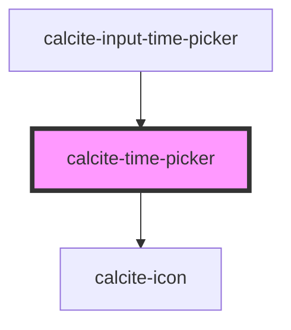

# calcite-time-picker

<!-- Auto Generated Below -->

## Properties

| Property            | Attribute             | Description                                                                                | Type                | Default     |
| ------------------- | --------------------- | ------------------------------------------------------------------------------------------ | ------------------- | ----------- |
| `hour`              | `hour`                | The hour value (24-hour format)                                                            | `string`            | `"--"`      |
| `hourDisplayFormat` | `hour-display-format` | Format of the hour value (12-hour or 24-hour) (this will be replaced by locale eventually) | `"12" \| "24"`      | `"12"`      |
| `minute`            | `minute`              | The minute value                                                                           | `string`            | `"--"`      |
| `scale`             | `scale`               | The scale (size) of the time picker                                                        | `"l" \| "m" \| "s"` | `"m"`       |
| `second`            | `second`              | The second value                                                                           | `string`            | `"--"`      |
| `step`              | `step`                | number that specifies the granularity that the value must adhere to                        | `number`            | `60`        |
| `theme`             | `theme`               | The color theme of the time-picker                                                         | `"dark" \| "light"` | `undefined` |

## Methods

### `setFocus() => Promise<void>`

#### Returns

Type: `Promise<void>`

## Dependencies

### Used by

- [calcite-input-time-picker](../calcite-input-time-picker)

### Depends on

- [calcite-icon](../calcite-icon)

### Graph

---

_Built with [StencilJS](https://stenciljs.com/)_
