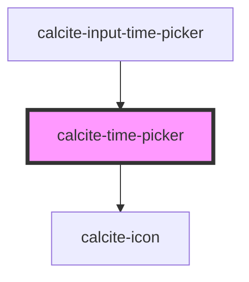

# calcite-time-picker

<!-- Auto Generated Below -->

## Properties

| Property            | Attribute             | Description                                                                                | Type                | Default             |
| ------------------- | --------------------- | ------------------------------------------------------------------------------------------ | ------------------- | ------------------- |
| `hour`              | `hour`                | The hour value (24-hour format)                                                            | `string`            | `"--"`              |
| `hourDisplayFormat` | `hour-display-format` | Format of the hour value (12-hour or 24-hour) (this will be replaced by locale eventually) | `"12" \| "24"`      | `"12"`              |
| `intlHour`          | `intl-hour`           | aria-label for the hour input                                                              | `string`            | `"hour"`            |
| `intlHourDown`      | `intl-hour-down`      | aria-label for the hour down button                                                        | `string`            | `"decrease hour"`   |
| `intlHourUp`        | `intl-hour-up`        | aria-label for the hour up button                                                          | `string`            | `"increase hour"`   |
| `intlMeridiem`      | `intl-meridiem`       | aria-label for the meridiem (am/pm) input                                                  | `string`            | `"AM/PM"`           |
| `intlMeridiemDown`  | `intl-meridiem-down`  | aria-label for the meridiem (am/pm) down button                                            | `string`            | `"decrease AM/PM"`  |
| `intlMeridiemUp`    | `intl-meridiem-up`    | aria-label for the meridiem (am/pm) up button                                              | `string`            | `"increase AM/PM"`  |
| `intlMinute`        | `intl-minute`         | aria-label for the minute input                                                            | `string`            | `"minute"`          |
| `intlMinuteDown`    | `intl-minute-down`    | aria-label for the minute down button                                                      | `string`            | `"decrease minute"` |
| `intlMinuteUp`      | `intl-minute-up`      | aria-label for the minute up button                                                        | `string`            | `"increase minute"` |
| `intlSecond`        | `intl-second`         | aria-label for the second input                                                            | `string`            | `"second"`          |
| `intlSecondDown`    | `intl-second-down`    | aria-label for the second down button                                                      | `string`            | `"decrease second"` |
| `intlSecondUp`      | `intl-second-up`      | aria-label for the second up button                                                        | `string`            | `"increase second"` |
| `minute`            | `minute`              | The minute value                                                                           | `string`            | `"--"`              |
| `scale`             | `scale`               | The scale (size) of the time picker                                                        | `"l" \| "m" \| "s"` | `"m"`               |
| `second`            | `second`              | The second value                                                                           | `string`            | `"--"`              |
| `step`              | `step`                | number that specifies the granularity that the value must adhere to                        | `number`            | `60`                |
| `theme`             | `theme`               | The color theme of the time-picker                                                         | `"dark" \| "light"` | `undefined`         |

## Methods

### `setFocus() => Promise<void>`

#### Returns

Type: `Promise<void>`

## Dependencies

### Used by

- [calcite-input-time-picker](../calcite-input-time-picker)

### Depends on

- [calcite-icon](../calcite-icon)

### Graph

---

_Built with [StencilJS](https://stenciljs.com/)_
