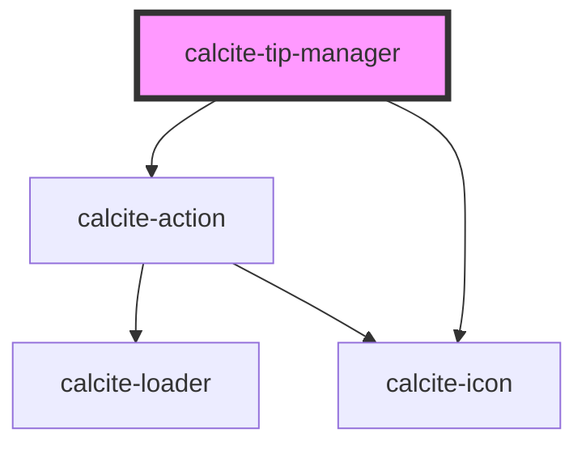

# calcite-tip-manager

The `calcite-tip-manager` component contains multiple `calcite-tip`s that a user can view through via interactive arrows to go back and forth through the tips in the deck.

<!-- Auto Generated Below -->

## Usage

### Basic

Renders a tip manager using a group of tips as well as a single tip.

```html
<calcite-tip-manager>
  <calcite-tip-group group-title="Tip Manager heading">
    <calcite-tip heading="Tip heading" selected>
      
      <p>
        Tip description lorem ipsum dolor sit amet, consectetur adipiscing elit, sed do eiusmod tempor incididunt ut
        labore et dolore magna aliqua.
      </p>
      <p>
        This is another slotted paragraph. Ut enim ad minim veniam, quis nostrud exercitation ullamco laboris nisi ut
        aliquip ex ea commodo consequat.
      </p>
      <calcite-link href="https://www.esri.com" target="_blank" rel="noopener noreferrer">A calcite-link</calcite-link>
    </calcite-tip>
    <calcite-tip heading="The Long Trees" hidden>
      
      <p>This tip has an image that is a pretty tall. And the text will run out before the end of the image.</p>
      <p>In astronomy, the terms object and body are often used interchangeably.</p>
      <calcite-link href="https://www.esri.com" target="_blank" rel="noopener noreferrer">A calcite-link</calcite-link>
    </calcite-tip>
  </calcite-tip-group>
  <calcite-tip heading="Square Nature" hidden>
    
    <p>This tip has an image that is square. And the text will run out before the end of the image.</p>
    <p>In astronomy, the terms object and body are often used interchangeably.</p>
    <p>
      In publishing and graphic design, Lorem ipsum is a placeholder text commonly used to demonstrate the visual form
      of a document without relying on meaningful content (also called greeking). Replacing the actual content with
      placeholder text allows designers to design the form of the content before the content itself has been produced.
    </p>
    <calcite-link href="https://www.esri.com" target="_blank" rel="noopener noreferrer">A calcite-link</calcite-link>
  </calcite-tip>
  <calcite-tip heading="The lack of imagery" hidden>
    <p>This tip has no image. As such, the content area will take up the entire width of the tip.</p>
    <p>
      This is the next paragraph and should show how wide the content area is now. Of course, the width of the overall
      tip will affect things. In astronomy, the terms object and body are often used interchangeably.
    </p>
    <calcite-link href="https://www.esri.com" target="_blank" rel="noopener noreferrer">A calcite-link</calcite-link>
  </calcite-tip>
</calcite-tip-manager>
```

## Properties

| Property              | Attribute               | Description                                                       | Type                         | Default     |
| --------------------- | ----------------------- | ----------------------------------------------------------------- | ---------------------------- | ----------- |
| `closed`              | `closed`                | Alternate text for closing the `calcite-tip-manager`.             | `boolean`                    | `false`     |
| `headingLevel`        | `heading-level`         | Number at which section headings should start for this component. | `1 \| 2 \| 3 \| 4 \| 5 \| 6` | `undefined` |
| `intlClose`           | `intl-close`            | Alternate text for closing the tip.                               | `string`                     | `undefined` |
| `intlDefaultTitle`    | `intl-default-title`    | The default group title for the `calcite-tip-manager`.            | `string`                     | `undefined` |
| `intlNext`            | `intl-next`             | Alternate text for navigating to the next tip.                    | `string`                     | `undefined` |
| `intlPaginationLabel` | `intl-pagination-label` | Label that appears on hover of pagination icon.                   | `string`                     | `undefined` |
| `intlPrevious`        | `intl-previous`         | Alternate text for navigating to the previous tip.                | `string`                     | `undefined` |

## Events

| Event                     | Description                                                             | Type               |
| ------------------------- | ----------------------------------------------------------------------- | ------------------ |
| `calciteTipManagerToggle` | Emitted when the `calcite-tip-manager` has been toggled open or closed. | `CustomEvent<any>` |

## Methods

### `nextTip() => Promise<void>`

Selects the next tip to display

#### Returns

Type: `Promise<void>`

### `previousTip() => Promise<void>`

Selects the previous tip to display

#### Returns

Type: `Promise<void>`

## Slots

| Slot | Description                       |
| ---- | --------------------------------- |
|      | A slot for adding `calcite-tip`s. |

## CSS Custom Properties

| Name                           | Description                                           |
| ------------------------------ | ----------------------------------------------------- |
| `--calcite-tip-manager-height` | the maximum height of the tip-manager                 |
| `--calcite-tip-max-width`      | the maximum width of a slotted tip within tip-manager |

## Dependencies

### Depends on

- [calcite-action](../calcite-action)
- [calcite-icon](../calcite-icon)

### Graph



---

_Built with [StencilJS](https://stenciljs.com/)_
