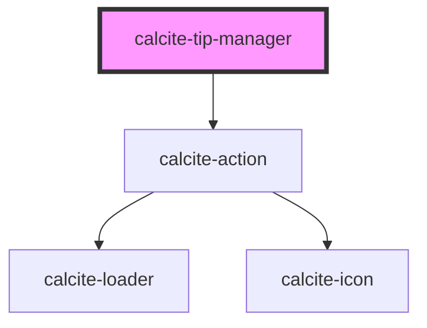

# calcite-tip-manager

The `calcite-tip-manager` component contains multiple `calcite-tip`s that a user can view through via interactive arrows to go back and forth through the tips in the deck.

<!-- Auto Generated Below -->

## Usage

### Basic

#### Basic

Renders a tip manager using a group of tips as well as a single tip.

```html
<calcite-tip-manager>
  <calcite-tip-group group-title="Greek Myth Stuff">
    <calcite-tip
      heading="Pegasus"
      thumbnail="https://placeimg.com/1000/600"
      text-thumbnail="This is an image of a horse with wings."
    >
      <p slot="info">
        Usually depicted as pure white, Pegasus is the offspring of the Olympian god Poseidon. He was foaled by the
        Gorgon Medusa upon her death, when the hero Perseus decapitated her.
      </p>
      <a slot="link" href="http://www.wingeddivinehorse.com">Magical flying horsey</a>
    </calcite-tip>
    <calcite-tip
      heading="Minotaur"
      thumbnail="https://placeimg.com/600/1000"
      text-thumbnail="This is an image of a man with a bull head and tail."
    >
      <p slot="info">
        The creature resided in the twisting maze of the labyrinth where it was offfered a regular sacrifice of youths
        and maidens to satisfy its cannibalistic hunger.
      </p>
      <a slot="link" href="http://www.cannibull.com">Bull headed man</a>
    </calcite-tip>
  </calcite-tip-group>
  <calcite-tip
    heading="Siren"
    thumbnail="https://placeimg.com/600/1000"
    text-thumbnail="This is an image of a half woman half bird."
  >
    <p slot="info">
      Dangerous creatures who lured nearby sailors with their enchanting music and singing voices to shipwreck on the
      rocky coast of their island.
    </p>
    <a slot="link" href="http://www.beautifulmurderer.com">Sexy bird lady</a>
  </calcite-tip>
</calcite-tip-manager>
```

## Properties

| Property              | Attribute               | Description                                                       | Type                         | Default     |
| --------------------- | ----------------------- | ----------------------------------------------------------------- | ---------------------------- | ----------- |
| `closed`              | `closed`                | Alternate text for closing the `calcite-tip-manager`.             | `boolean`                    | `false`     |
| `headingLevel`        | `heading-level`         | Number at which section headings should start for this component. | `1 \| 2 \| 3 \| 4 \| 5 \| 6` | `undefined` |
| `intlClose`           | `intl-close`            | Alternate text for closing the tip.                               | `string`                     | `undefined` |
| `intlDefaultTitle`    | `intl-default-title`    | The default group title for the `calcite-tip-manager`.            | `string`                     | `undefined` |
| `intlNext`            | `intl-next`             | Alternate text for navigating to the next tip.                    | `string`                     | `undefined` |
| `intlPaginationLabel` | `intl-pagination-label` | Label that appears on hover of pagination icon.                   | `string`                     | `undefined` |
| `intlPrevious`        | `intl-previous`         | Alternate text for navigating to the previous tip.                | `string`                     | `undefined` |
| `theme`               | `theme`                 | Used to set the component's color scheme.                         | `"dark" \| "light"`          | `undefined` |

## Events

| Event                     | Description                                                             | Type               |
| ------------------------- | ----------------------------------------------------------------------- | ------------------ |
| `calciteTipManagerToggle` | Emitted when the `calcite-tip-manager` has been toggled open or closed. | `CustomEvent<any>` |

## Methods

### `nextTip() => Promise<void>`

#### Returns

Type: `Promise<void>`

### `previousTip() => Promise<void>`

#### Returns

Type: `Promise<void>`

## Slots

| Slot | Description                       |
| ---- | --------------------------------- |
|      | A slot for adding `calcite-tip`s. |

## Dependencies

### Depends on

- [calcite-action](../calcite-action)

### Graph



---

_Built with [StencilJS](https://stenciljs.com/)_
