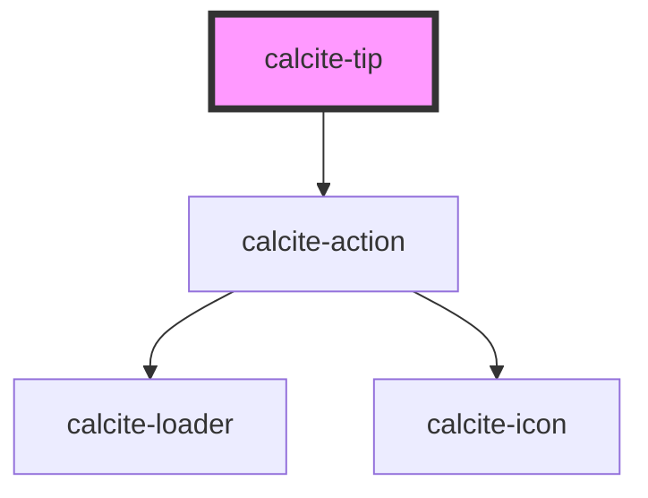

# calcite-tip

The `calcite-tip` component can comprise of an image, text and hyperlink to give helpful hints to a user about using the platform.

<!-- Auto Generated Below -->

## Usage

### Basic

#### Basic

Renders a non-dismissible tip with a heading, thumbnail, info and a link.

```html
<calcite-tip non-dismissible heading="Celestial Bodies!">
  
  <p>Normal tip with a landscape or square image and a small amount of text in the "info" slot.</p>
  <a href="http://www.esri.com">Put a link hurr!</a>
</calcite-tip>
```

## Properties

| Property         | Attribute         | Description                                                                       | Type                         | Default     |
| ---------------- | ----------------- | --------------------------------------------------------------------------------- | ---------------------------- | ----------- |
| `dismissed`      | `dismissed`       | No longer displays the tip.                                                       | `boolean`                    | `false`     |
| `heading`        | `heading`         | The heading of the tip.                                                           | `string`                     | `undefined` |
| `headingLevel`   | `heading-level`   | Number at which section headings should start for this component.                 | `1 \| 2 \| 3 \| 4 \| 5 \| 6` | `undefined` |
| `intlClose`      | `intl-close`      | Alternate text for closing the tip.                                               | `string`                     | `undefined` |
| `nonDismissible` | `non-dismissible` | Indicates whether the tip can be dismissed.                                       | `boolean`                    | `false`     |
| `selected`       | `selected`        | The selected state of the tip if it is being used inside a `calcite-tip-manager`. | `boolean`                    | `undefined` |

## Events

| Event               | Description                                    | Type               |
| ------------------- | ---------------------------------------------- | ------------------ |
| `calciteTipDismiss` | Emitted when the component has been dismissed. | `CustomEvent<any>` |

## Slots

| Slot          | Description                                         |
| ------------- | --------------------------------------------------- |
| `"thumbnail"` | A slot for adding an HTML image element to the tip. |

## Dependencies

### Depends on

- [calcite-action](../calcite-action)

### Graph



---

_Built with [StencilJS](https://stenciljs.com/)_
