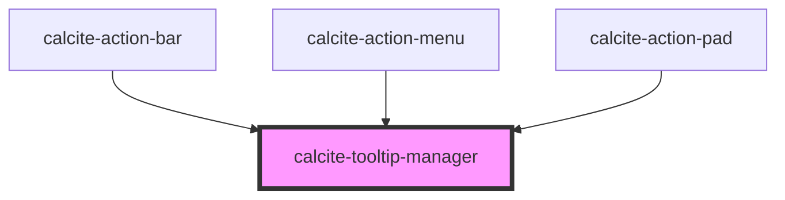

# calcite-tooltip-manager

<!-- Auto Generated Below -->

## Properties

| Property   | Attribute  | Description                                                                                                                                              | Type     | Default                  |
| ---------- | ---------- | -------------------------------------------------------------------------------------------------------------------------------------------------------- | -------- | ------------------------ |
| `selector` | `selector` | CSS Selector to match reference elements for tooltips. Reference elements will be identified by this selector in order to open their associated tooltip. | `string` | `[${TOOLTIP_REFERENCE}]` |

## Slots

| Slot | Description                                                                               |
| ---- | ----------------------------------------------------------------------------------------- |
|      | A slot for adding elements that reference a 'calcite-tooltip' by the 'selector' property. |

## Dependencies

### Used by

- [calcite-action-bar](../calcite-action-bar)
- [calcite-action-menu](../calcite-action-menu)
- [calcite-action-pad](../calcite-action-pad)

### Graph

---

_Built with [StencilJS](https://stenciljs.com/)_
