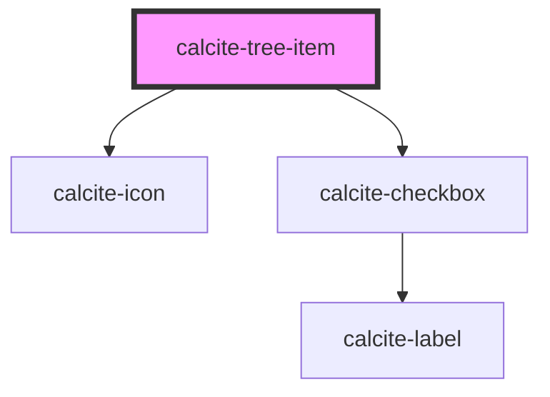

# calcite-tree-item

`<calcite-tree-item>` is used to represent a single item in a `<calcite-tree>`.

<!-- Auto Generated Below -->

## Properties

| Property   | Attribute  | Description                              | Type      | Default |
| ---------- | ---------- | ---------------------------------------- | --------- | ------- |
| `expanded` | `expanded` | True if the item is in an expanded state | `boolean` | `false` |
| `selected` | `selected` | Is the item currently selected           | `boolean` | `false` |

## Dependencies

### Depends on

- [calcite-icon](../calcite-icon)
- [calcite-checkbox](../calcite-checkbox)

### Graph

---

_Built with [StencilJS](https://stenciljs.com/)_
