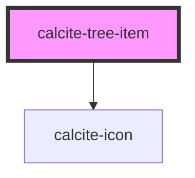

# calcite-tree-item

`<calcite-tree-item>` is used to represent a single item in a `<calcite-tree>`.

```html
<calcite-tree>
  <calcite-tree-item>
    <a href="#">Child 1</a>
    <calcite-tree slot="children">
      <calcite-tree-item>
        <a href="#">Grandchild 1</a>
      <calcite-tree-item>
      <calcite-tree-item>
        <a href="#">Grandchild 2</a>
      <calcite-tree-item>
    <calcite-tree>
  <calcite-tree-item>
</calcite-tree>
```

<!-- Auto Generated Below -->


## Properties

| Property   | Attribute  | Description                              | Type      | Default |
| ---------- | ---------- | ---------------------------------------- | --------- | ------- |
| `expanded` | `expanded` | True if the item is in an expanded state | `boolean` | `false` |
| `selected` | `selected` | Is the item currently selected           | `boolean` | `false` |


## Events

| Event                   | Description | Type                                |
| ----------------------- | ----------- | ----------------------------------- |
| `calciteTreeItemSelect` |             | `CustomEvent<TreeItemSelectDetail>` |


## Dependencies

### Depends on

- [calcite-icon](../calcite-icon)

### Graph


----------------------------------------------

*Built with [StencilJS](https://stenciljs.com/)*
