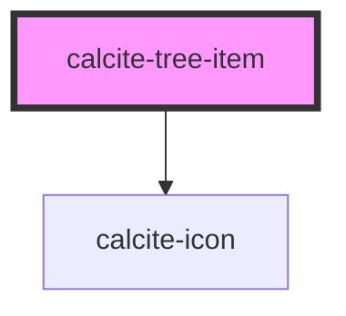

# calcite-tree-item

`<calcite-tree-item>` is used to represent a single item in a `<calcite-tree>`.

```html
<calcite-tree>
  <calcite-tree-item>
    <a href="#">Child 1</a>
    <calcite-tree slot="children">
      <calcite-tree-item>
        <a href="#">Grandchild 1</a>
      <calcite-tree-item>
      <calcite-tree-item>
        <a href="#">Grandchild 2</a>
      <calcite-tree-item>
    <calcite-tree>
  <calcite-tree-item>
</calcite-tree>
```

<!-- Auto Generated Below -->


## Properties

| Property         | Attribute         | Description                                                                                                                                                                  | Type      | Default |
| ---------------- | ----------------- | ---------------------------------------------------------------------------------------------------------------------------------------------------------------------------- | --------- | ------- |
| `depth`          | `depth`           |                                                                                                                                                                              | `number`  | `-1`    |
| `expanded`       | `expanded`        |                                                                                                                                                                              | `boolean` | `false` |
| `hasChildren`    | `has-children`    |                                                                                                                                                                              | `boolean` | `null`  |
| `parentExpanded` | `parent-expanded` |                                                                                                                                                                              | `boolean` | `false` |
| `selected`       | `selected`        | Be sure to add a jsdoc comment describing your property for the generated readme file. If your property should be hidden from documentation, you can use the `@internal` tag | `boolean` | `false` |


## Events

| Event                   | Description | Type                                |
| ----------------------- | ----------- | ----------------------------------- |
| `calciteTreeItemSelect` |             | `CustomEvent<TreeItemSelectDetail>` |


## Dependencies

### Depends on

- [calcite-icon](../calcite-icon)

### Graph


----------------------------------------------

*Built with [StencilJS](https://stenciljs.com/)*
