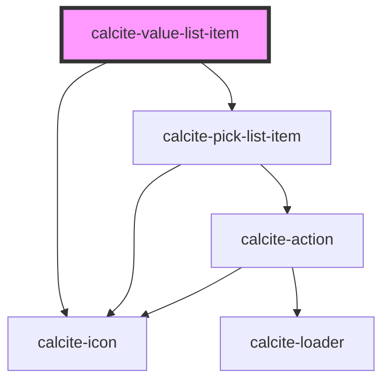

# calcite-value-list-item

`calcite-value-list-item`s are cards contained in a `calcite-value-list`. They each can have a label and description, an icon and can have their label's be editable (inherited from `calcite-value-list`). The developer can disable or preselect each list item and give it a value.

<!-- Auto Generated Below -->

## Properties

| Property             | Attribute     | Description                                                                                       | Type                                                        | Default     |
| -------------------- | ------------- | ------------------------------------------------------------------------------------------------- | ----------------------------------------------------------- | ----------- |
| `description`        | `description` | An optional description for this item. Will appear below the label text.                          | `string`                                                    | `undefined` |
| `disabled`           | `disabled`    | When true, the item cannot be clicked and is visually muted                                       | `boolean`                                                   | `false`     |
| `icon`               | `icon`        | Determines the icon SVG symbol that will be shown. Options are circle, square, grid or null.      | `ICON_TYPES.circle \| ICON_TYPES.grip \| ICON_TYPES.square` | `null`      |
| `label` _(required)_ | `label`       | The main label for this item. Appears next to the icon.                                           | `string`                                                    | `undefined` |
| `metadata`           | --            | Used to provide additional metadata to an item, primarily used when the parent list has a filter. | `{ [x: string]: unknown; }`                                 | `undefined` |
| `removable`          | `removable`   | Set this to true to display a remove action that removes the item from the list.                  | `boolean`                                                   | `false`     |
| `selected`           | `selected`    | Set this to true to pre-select an item. Toggles when an item is checked/unchecked.                | `boolean`                                                   | `false`     |
| `value` _(required)_ | `value`       | The item's associated value.                                                                      | `any`                                                       | `undefined` |

## Events

| Event                   | Description                                    | Type                |
| ----------------------- | ---------------------------------------------- | ------------------- |
| `calciteListItemRemove` | Emitted whenever the remove button is pressed. | `CustomEvent<void>` |

## Methods

### `setFocus() => Promise<void>`

#### Returns

Type: `Promise<void>`

### `toggleSelected(coerce?: boolean) => Promise<void>`

#### Returns

Type: `Promise<void>`

## Slots

| Slot              | Description                                                         |
| ----------------- | ------------------------------------------------------------------- |
| `"actions-end"`   | A slot for adding actions or content to the end side of the item.   |
| `"actions-start"` | A slot for adding actions or content to the start side of the item. |

## Dependencies

### Depends on

- [calcite-icon](../calcite-icon)
- [calcite-pick-list-item](../calcite-pick-list-item)

### Graph

---

_Built with [StencilJS](https://stenciljs.com/)_
