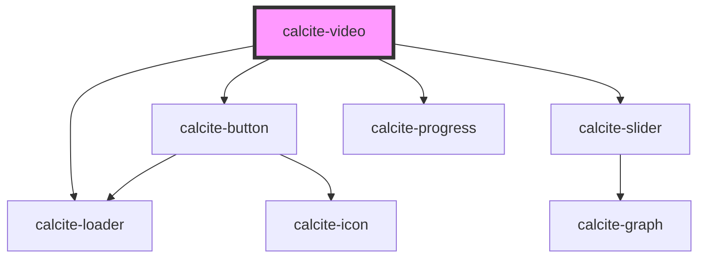

# calcite-chip

<!-- Auto Generated Below -->

## Properties

| Property              | Attribute                | Description                                          | Type                            | Default     |
| --------------------- | ------------------------ | ---------------------------------------------------- | ------------------------------- | ----------- |
| `allowFullscreen`     | `allow-fullscreen`       | is fullscreen mode allowed                           | `boolean`                       | `false`     |
| `allowScrubbing`      | `allow-scrubbing`        | is scrubbing mode allowed                            | `boolean`                       | `false`     |
| `autoplay`            | `autoplay`               | autoplay the media                                   | `boolean`                       | `false`     |
| `height`              | `height`                 | a desired height of the video                        | `string`                        | `undefined` |
| `hideControls`        | `hide-controls`          | hide controls                                        | `boolean`                       | `false`     |
| `hideProgress`        | `hide-progress`          | hide progress                                        | `boolean`                       | `false`     |
| `hideTimestamp`       | `hide-timestamp`         | hide timestamp                                       | `boolean`                       | `false`     |
| `loop`                | `loop`                   | loop the media                                       | `boolean`                       | `false`     |
| `muted`               | `muted`                  | is the media muted                                   | `boolean`                       | `false`     |
| `playOnHover`         | `play-on-hover`          | allow play on hover                                  | `boolean`                       | `false`     |
| `preload`             | `preload`                | preload type                                         | `"auto" \| "none" \| "preload"` | `"auto"`    |
| `scale`               | `scale`                  | specify the scale of the video player, defaults to m | `"l" \| "m" \| "s"`             | `"m"`       |
| `showControlsOnHover` | `show-controls-on-hover` | hide controls                                        | `boolean`                       | `false`     |
| `src`                 | `src`                    | the src of the media                                 | `string`                        | `undefined` |
| `theme`               | `theme`                  | Select theme (light or dark)                         | `"dark" \| "light"`             | `undefined` |
| `width`               | `width`                  | a desired width of the video                         | `string`                        | `undefined` |

## Events

| Event                  | Description | Type               |
| ---------------------- | ----------- | ------------------ |
| `calciteVideoComplete` |             | `CustomEvent<any>` |
| `calciteVideoPause`    |             | `CustomEvent<any>` |
| `calciteVideoPlay`     |             | `CustomEvent<any>` |

## Dependencies

### Depends on

- [calcite-button](../calcite-button)
- [calcite-slider](../calcite-slider)
- [calcite-progress](../calcite-progress)
- [calcite-loader](../calcite-loader)

### Graph

---

_Built with [StencilJS](https://stenciljs.com/)_
