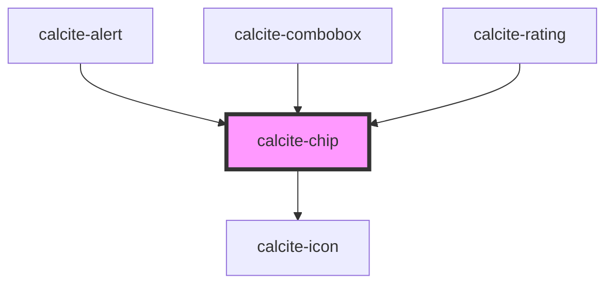

# calcite-chip

<!-- Auto Generated Below -->

## Usage

### Basic

```html
<calcite-chip value="Global" closable icon="globe" appearance="clear" color="green">Global</calcite-chip>
```

## Properties

| Property             | Attribute           | Description                                                                                  | Type                                               | Default     |
| -------------------- | ------------------- | -------------------------------------------------------------------------------------------- | -------------------------------------------------- | ----------- |
| `appearance`         | `appearance`        | Specifies the appearance style of the component.                                             | `"solid" \| "transparent"`                         | `"solid"`   |
| `closable`           | `closable`          | When `true`, a close button is added to the component.                                       | `boolean`                                          | `false`     |
| `closed`             | `closed`            | When `true`, hides the component.                                                            | `boolean`                                          | `false`     |
| `color`              | `color`             | Specifies the color for the component.                                                       | `"blue" \| "green" \| "grey" \| "red" \| "yellow"` | `"grey"`    |
| `icon`               | `icon`              | Specifies an icon to display.                                                                | `string`                                           | `undefined` |
| `iconFlipRtl`        | `icon-flip-rtl`     | When `true`, the icon will be flipped when the element direction is right-to-left (`"rtl"`). | `boolean`                                          | `false`     |
| `messageOverrides`   | `message-overrides` | Use this property to override individual strings used by the component.                      | `Messages`                                         | `undefined` |
| `scale`              | `scale`             | Specifies the size of the component.                                                         | `"l" \| "m" \| "s"`                                | `"m"`       |
| `value` _(required)_ | `value`             | The component's value.                                                                       | `any`                                              | `undefined` |

## Events

| Event              | Description                                                                                                                                             | Type               |
| ------------------ | ------------------------------------------------------------------------------------------------------------------------------------------------------- | ------------------ |
| `calciteChipClose` | Fires when the close button is clicked. **Note:**: The `el` event payload props is deprecated, please use the event's `target`/`currentTarget` instead. | `CustomEvent<any>` |

## Methods

### `setFocus() => Promise<void>`

Sets focus on the component.

#### Returns

Type: `Promise<void>`

## Slots

| Slot      | Description                 |
| --------- | --------------------------- |
|           | A slot for adding text.     |
| `"image"` | A slot for adding an image. |

## Dependencies

### Used by

- [calcite-alert](../alert)
- [calcite-combobox](../combobox)
- [calcite-rating](../rating)

### Depends on

- [calcite-icon](../icon)

### Graph



---

_Built with [StencilJS](https://stenciljs.com/)_
