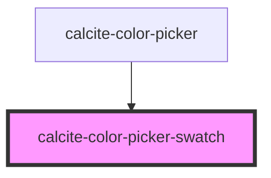

# calcite-color-picker-swatch

<!-- Auto Generated Below -->

## Properties

| Property | Attribute | Description                           | Type                | Default     |
| -------- | --------- | ------------------------------------- | ------------------- | ----------- |
| `active` | `active`  | When `true`, the component is active. | `boolean`           | `false`     |
| `color`  | `color`   | The color value.                      | `string`            | `undefined` |
| `scale`  | `scale`   | Specifies the size of the component.  | `"l" \| "m" \| "s"` | `"m"`       |

## Dependencies

### Used by

- [calcite-color-picker](../color-picker)

### Graph

---

_Built with [StencilJS](https://stenciljs.com/)_
